# Helm — 스마트 컨트랙트 아키텍처 가이드

> **대상 독자**: 프로젝트 작성자 본인 + 합류하는 BE/FE 팀원.
> **목적**: *구조 이해*에 집중. *진행 상황*은 [CONTRACT_STATUS.md](CONTRACT_STATUS.md) 참고.
>
> 이 문서는 mermaid 다이어그램, 시퀀스 흐름, 권한 매트릭스, 구체적 수치 시나리오 위주로 구성됨. 처음에는 위에서 아래로 정독, 이후에는 6 / 10 / 11절을 레퍼런스로 활용 권장.

---

## 목차

1. [시스템 맵](#1-시스템-맵)
2. [에이전트별 vs 시스템 단위](#2-에이전트별-vs-시스템-단위)
3. [라이프사이클 상태 머신](#3-라이프사이클-상태-머신)
4. [시퀀스 다이어그램 — 주요 플로우](#4-시퀀스-다이어그램--주요-플로우)
5. [자금 흐름 — 구체적 수치 시나리오](#5-자금-흐름--구체적-수치-시나리오)
6. [권한 매트릭스](#6-권한-매트릭스)
7. [컨트랙트별 스토리지 레이아웃](#7-컨트랙트별-스토리지-레이아웃)
8. [시나리오별 이벤트 흐름](#8-시나리오별-이벤트-흐름)
9. [횡단 관심사 (Cross-cutting concerns)](#9-횡단-관심사)
10. [치트시트](#10-치트시트)
11. [에러 디코더](#11-에러-디코더)
12. [상속 및 의존성 그래프](#12-상속-및-의존성-그래프)

---

## 1. 시스템 맵

전체 시스템을 한 화면에. 실선은 상태 변경 호출, 점선은 읽기 호출.

```mermaid
flowchart TB
    %% ─── 외부 액터 ─────────────────────────────────────────────
    subgraph Actors[" "]
        direction LR
        Founder([Founder - 창업자])
        Holder([Holder - 보유자])
        BE([BE Executor / Indexer])
        Admin([Admin - 관리자])
    end

    %% ─── 온체인 싱글톤 ─────────────────────────────────────────
    subgraph Sys[시스템 싱글톤]
        direction TB
        Reg[HelmRegistry]
        NFT[AgentNFT - ERC-721]
        TP[TimeProvider]
        Treas[PlatformTreasury]
        Q[RedemptionQueue]
    end

    subgraph Yield[Yield 싱글톤]
        direction TB
        H[YieldHarvester]
        D[DividendDistributor]
    end

    subgraph Adapters[Adapter 싱글톤]
        direction TB
        Pyth[PythPriceAdapter]
        ME[MantleMETHAdapter]
        UY[OndoUSDYAdapter]
        SY1[SyntheticAsset - sNVDA]
        SYn[SyntheticAsset - sSPY/sAAPL/sTSLA/sMSFT]
    end

    %% ─── 에이전트별 클론 (에이전트당 1세트) ────────────────────
    subgraph Clones[에이전트별 클론 - EIP-1167]
        direction TB
        Tok[AgentToken]
        V[AgentVault]
        FV[FounderVault]
    end

    %% ─── 외부 / 오프체인 ───────────────────────────────────────
    subgraph Ext[외부]
        direction TB
        PythNet[(Pyth Network)]
        USDC[(USDC ERC-20)]
        mETHReal[(Mantle mETH 실제 프록시)]
    end

    %% ─── 호출 관계 ─────────────────────────────────────────────
    Founder -->|registerAgent| Reg
    Holder -->|deposit / requestRedeem / claim| V
    Holder -->|claim| D
    Holder -->|requestRedeem / claim| Q
    BE -->|executeRebalance| V
    BE -->|harvest / distribute| H
    Admin -->|setAllowedTiers / setFeeRate / advance| Reg
    Admin -->|setFeeRate| Treas
    Admin -->|setAllowedTiers| Q
    Admin -->|advance / reset| TP

    Reg -->|clone + initialize| Tok
    Reg -->|clone + initialize| V
    Reg -->|clone + initialize| FV
    Reg -->|mint| NFT
    Reg -.->|markWindDown / notifyMandateBreach| NFT

    V -->|mint / burn| Tok
    V -->|mint/burn synth| SY1
    V -->|deposit/redeem| ME
    V -->|deposit/redeem| UY
    V -->|collectFee + transfer| Treas
    V -.->|valueInUSDC| ME
    V -.->|valueInUSDC| UY
    V -.->|priceUSDC| SY1
    V -.->|currentTime| TP

    Q -->|fulfillRedemption| V
    Q -.->|deploymentOf| Reg
    Q -.->|currentTime| TP

    H -->|harvestYield| ME
    H -->|harvestYield| UY
    H -->|depositYield| V
    H -.->|deploymentOf| Reg

    D -->|receiveCarry| FV
    D -.->|deploymentOf| Reg

    FV -->|triggerWindDown| V
    FV -.->|currentTime| TP

    SY1 -.->|getPriceUsdc| Pyth
    Pyth -.->|getPriceUnsafe| PythNet
    ME -.->|getPriceUnsafe ETH/USD| PythNet
    ME -.->|reference only| mETHReal

    V -.->|USDC asset| USDC
    Treas -.->|holds| USDC
    FV -.->|holds USDC carry| USDC
    H -.->|forwards USDC| USDC
    D -.->|holds staged USDC| USDC

    classDef singleton fill:#dbeafe,stroke:#1e40af,color:#1e3a8a
    classDef clone     fill:#dcfce7,stroke:#15803d,color:#14532d
    classDef external  fill:#e5e7eb,stroke:#374151,color:#111827
    classDef actor     fill:#fed7aa,stroke:#c2410c,color:#7c2d12
    class Reg,NFT,TP,Treas,Q,H,D,Pyth,ME,UY,SY1,SYn singleton
    class Tok,V,FV clone
    class PythNet,USDC,mETHReal external
    class Founder,Holder,BE,Admin actor
```

**색상 해석**:

- 🟦 **파란색** = 시스템 싱글톤 (한 번만 배포, 모든 에이전트가 공유)
- 🟩 **녹색** = 에이전트별 클론 (EIP-1167 미니멀 프록시, 에이전트당 3개 세트)
- ⬜ **회색** = 외부 컨트랙트 또는 토큰 (우리가 배포하지 않음)
- 🟧 **주황색** = 오프체인 액터

> **NOTE**: `SyntheticAsset`은 **자산별로** 싱글톤 (sNVDA, sSPY, sAAPL, sTSLA, sMSFT 각각 하나씩). 주식 한 종목당 컨트랙트 하나이며, 해당 자산을 화이트리스트한 모든 에이전트가 공유.

---

## 2. 에이전트별 vs 시스템 단위

### 에이전트 등록 시 클론되는 항목

`HelmRegistry.registerAgent(...)` 호출 시, **EIP-1167 미니멀 프록시 클론 3개**가 배포됨. 에이전트마다 자신만의 3개 세트 보유.

```
┌─────────────────────────────────────────────────────────────────┐
│              에이전트별 (클론, EIP-1167)                          │
│                                                                  │
│   ┌──────────────┐    ┌──────────────┐    ┌──────────────────┐  │
│   │  AgentToken  │◄──►│  AgentVault  │◄──►│  FounderVault    │  │
│   │  (ERC-20)    │    │  (ERC-4626)  │    │  (custody)       │  │
│   └──────────────┘    └──────────────┘    └──────────────────┘  │
│         AGT-1               vault-1            founderVault-1    │
└─────────────────────────────────────────────────────────────────┘

                   모든 에이전트가 공유

┌─────────────────────────────────────────────────────────────────┐
│              시스템 단위 싱글톤 (한 번만 배포)                     │
│                                                                  │
│  HelmRegistry      AgentNFT           TimeProvider               │
│  PlatformTreasury  RedemptionQueue    YieldHarvester             │
│  DividendDistributor                                             │
│                                                                  │
│  PythPriceAdapter  MantleMETHAdapter  OndoUSDYAdapter            │
│  SyntheticAsset × 5  (sNVDA, sSPY, sAAPL, sTSLA, sMSFT)          │
└─────────────────────────────────────────────────────────────────┘
```

### 왜 이렇게 나눴나?

- **싱글톤**은 에이전트 간 공통 상태 (평판, 수수료, 큐, 가격) + 상수를 보유. 한 번만 배포하므로 가스 절감 + 감사 surface 축소.
- **클론**은 에이전트별 상태 (NAV, 보유자, mandate) 보유. EIP-1167 미니멀 프록시는 약 45바이트 바이트코드, 약 150k 가스로 배포 가능. 전체 구현체를 매번 다시 배포하면 ~5M+ 가스 발생.

### Implementation 컨트랙트 vs 클론

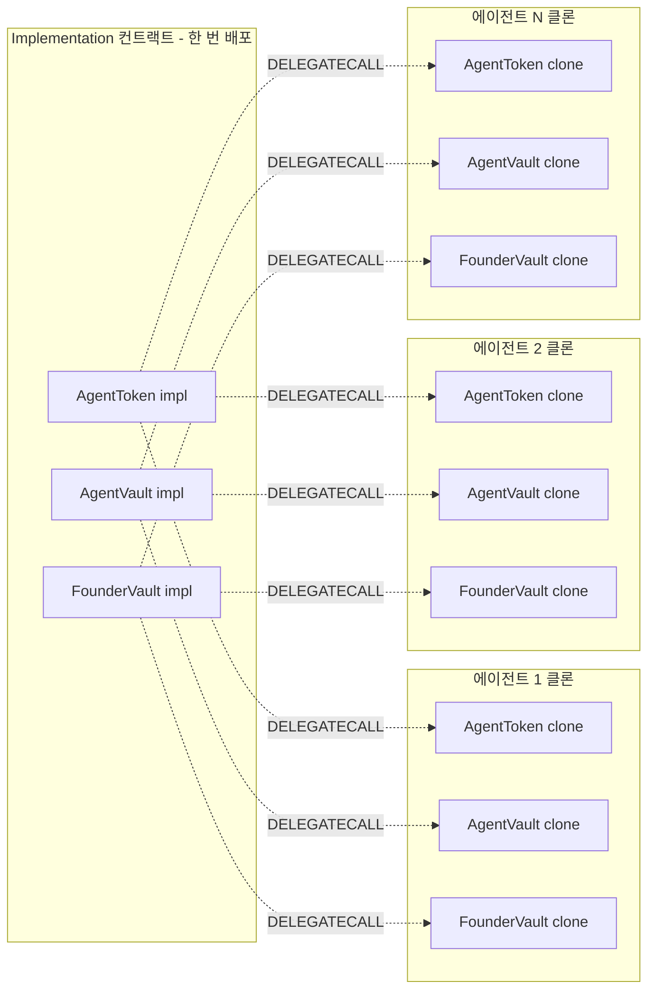

각 클론은 자신만의 스토리지 슬롯을 보유하되 로직은 implementation에서 실행. Implementation의 생성자에서 `_disableInitializers()`를 호출해 implementation 자체는 절대 초기화 불가 — 클론만 초기화 가능.

---

## 3. 라이프사이클 상태 머신

`AgentVault.phase`가 마스터 상태. 모든 외부 액션은 현재 phase를 체크.

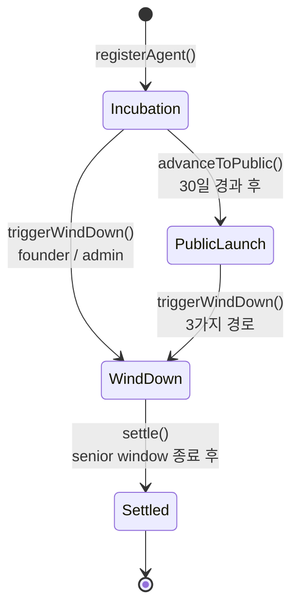

### 전환 상세

| From | To | 함수 | 호출자 | 사전 조건 | 발생 이벤트 |
|---|---|---|---|---|---|
| `[init]` | `Incubation` | `HelmRegistry.registerAgent` | Founder | seed ≥ 1000 USDC; mandateHash 미사용; mandateURI 비어있지 않음 | `AgentRegistered`, `AgentNFTMinted`, `SharesDeposited` |
| `Incubation` | `PublicLaunch` | `HelmRegistry.advanceToPublic` | 누구나 | `now ≥ incubationStart + 30 days` | `PhaseAdvanced(Incubation, PublicLaunch)`, `PhaseChanged` |
| `Incubation` / `PublicLaunch` | `WindDown` | `AgentVault.triggerWindDown` | FounderVault / Registry / Queue | `!windDown.active` | `WindDownTriggered`, `PhaseChanged`, `AgentWindDown`, `ReputationSlashed(2000 bps)` |
| `WindDown` | `Settled` | `AgentVault.settle` | 누구나 | `now ≥ seniorWindowEnd`; 모든 포지션 청산 완료 | `Settled`, `PhaseChanged`, `AgentSettled` |

> **NOTE**: `IHelmRegistry`에 `Phase.Slashed`가 존재하지만 (관리자 강제 종료용), 실제 운영 경로는 wind-down + 평판 슬래시 (`markWindDown`). Vault 자체는 `Slashed` 상태에 들어가지 않음.

### Phase별 민트 허용 매트릭스

| Phase | Founder 입금 | 일반 입금 | 환매 (큐 경유) | 리밸런스 | Yield harvest | Wind-down 동작 |
|---|---|---|---|---|---|---|
| `Incubation` | ✅ | ❌ (`OnlyFounderDuringIncubation`) | ✅ | ✅ | ✅ | `triggerWindDown`만 |
| `PublicLaunch` | ✅ | ✅ | ✅ | ✅ | ✅ | `triggerWindDown`만 |
| `WindDown` | ❌ (`MintsDisabled`) | ❌ | senior만 (window 동안) | ❌ (`WindDownActive`) | n/a | `progressWindDown`, `settle` |
| `Settled` | ❌ | ❌ | ❌ | ❌ | ❌ | 종료 상태 |

---

## 4. 시퀀스 다이어그램 — 주요 플로우

### 4.1 에이전트 등록

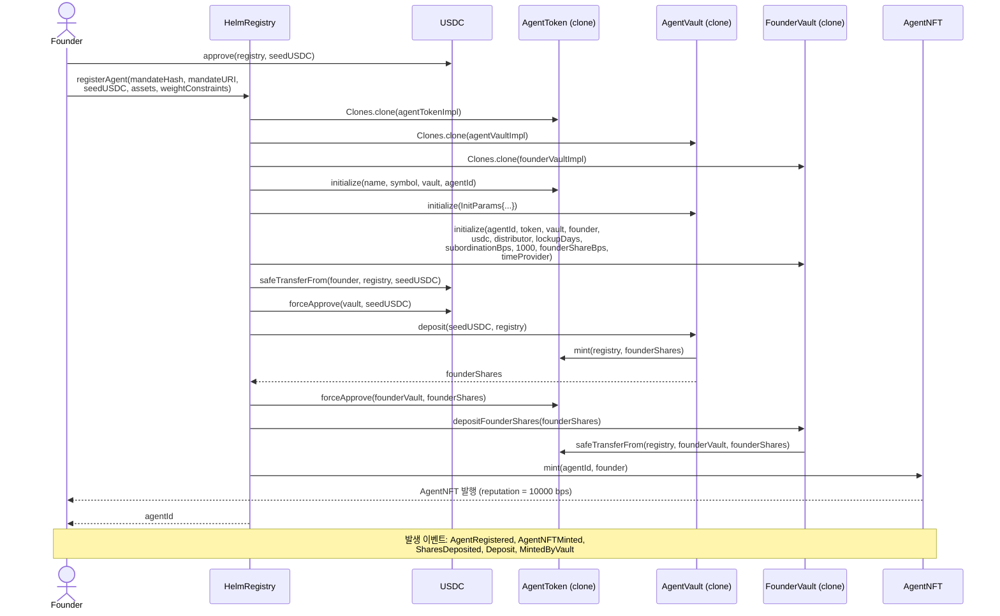

### 4.2 PublicLaunch 단계의 민트

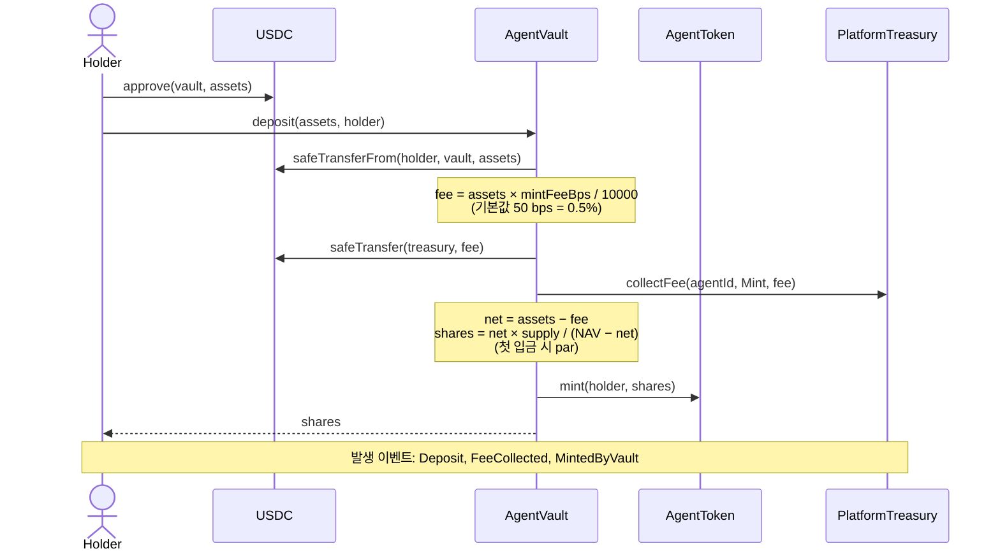

### 4.3 리밸런스

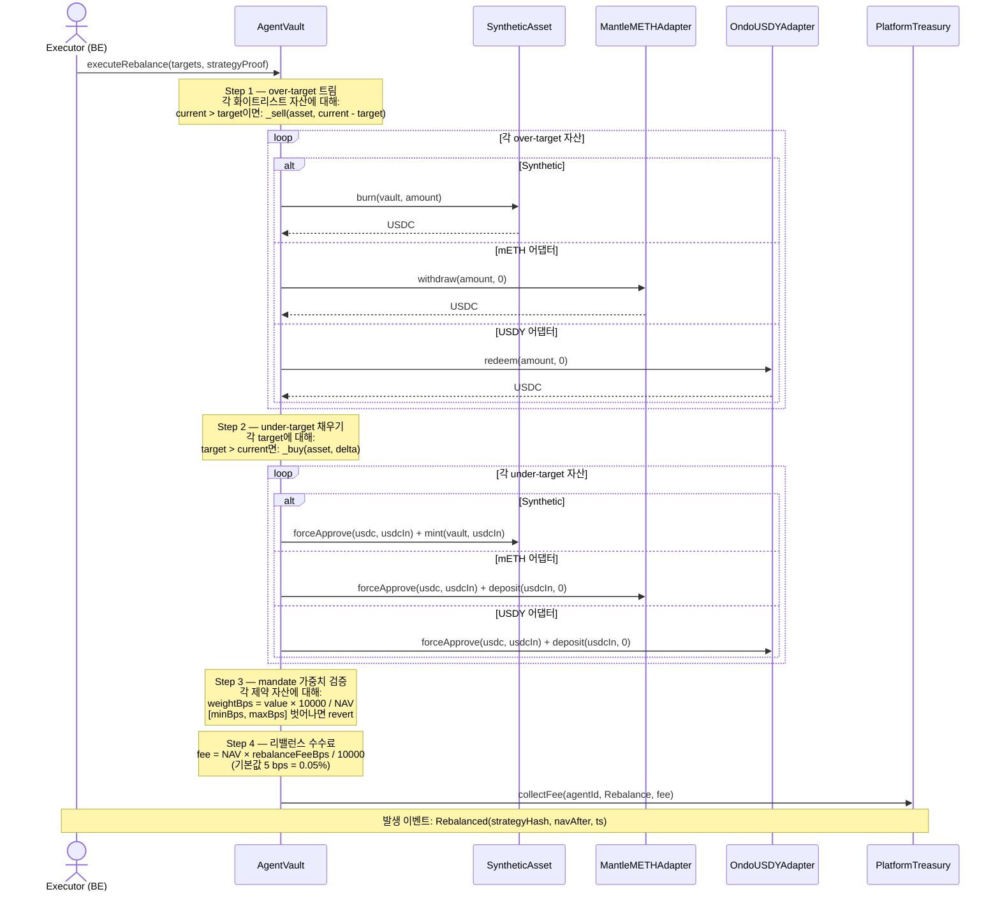

> **NOTE**: Step 3에서 revert되면 BE indexer가 실패한 tx를 감지해 vault를 거쳐 `HelmRegistry.notifyMandateBreach`를 호출, AgentNFT를 1000 bps 슬래시. Revert와 슬래시는 의도적으로 원자적이지 않음 — [§4.10](#410-mandate-위반) 참고.

### 4.4 Yield 수확 + 배당 분배

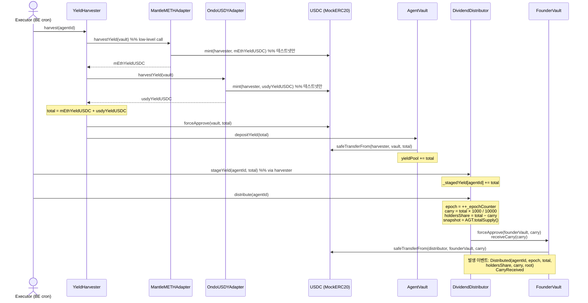

### 4.5 보유자가 배당 청구

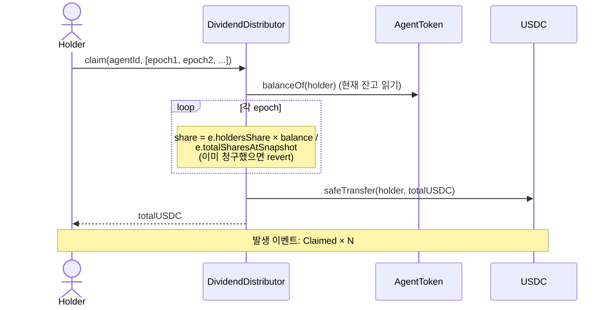

### 4.6 30일 락업 환매

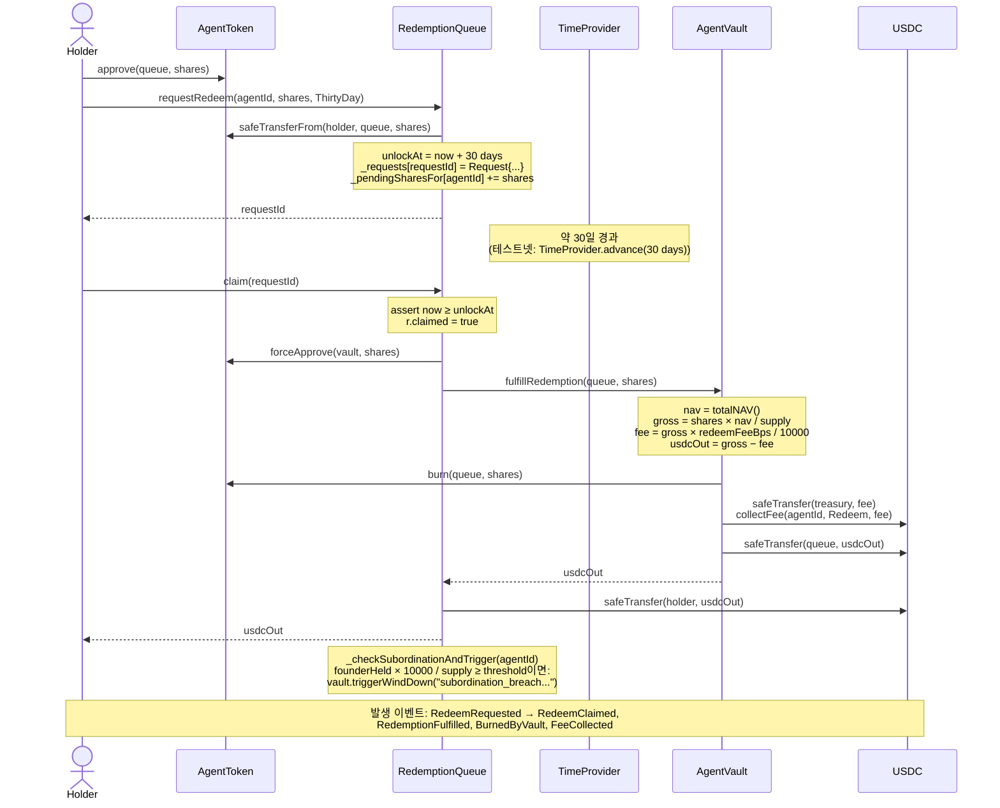

### 4.7 Wind-down 트리거 1 (창업자 수동)

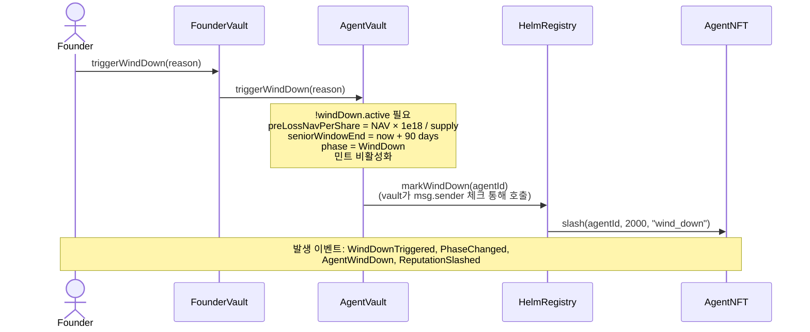

### 4.8 Wind-down 트리거 2 (환매를 통한 subordination 위반)

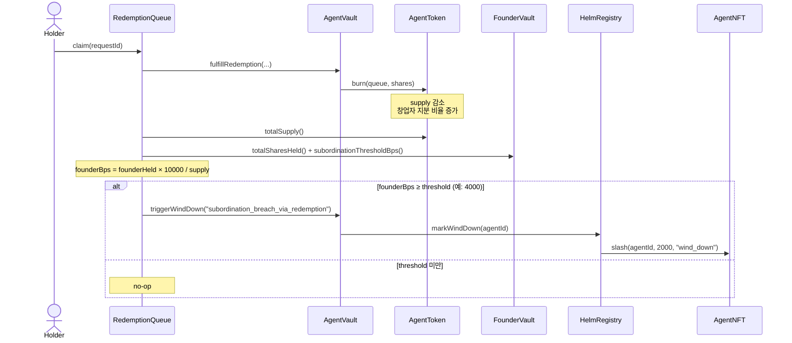

> **이 자동 트리거가 왜 필요한가?** 외부 보유자가 환매할수록 창업자의 *유효* 지분 비율이 상승. 일정 임계값을 넘으면 더 이상 subordinated 상태가 아니게 됨 — 추가 환매를 창업자가 지배할 수 있음. 자동 트리거가 wind-down을 강제해, 남아 있는 senior들이 사전 손실 NAV (preLossNavPerShare) 우선권을 받을 수 있게 만들어 보호 메커니즘이 무효화되기 전에 락인.

### 4.9 Wind-down 진행 및 settlement

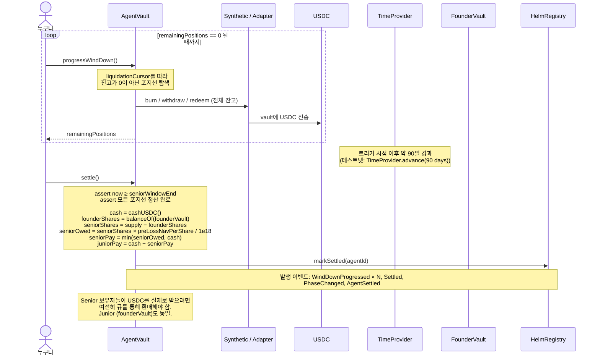

### 4.10 Mandate 위반

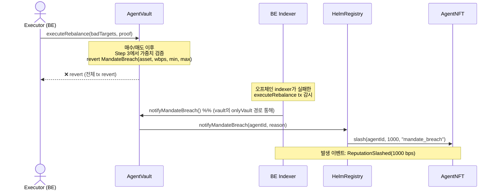

> **설계 노트**: 단일 tx가 리밸런스를 revert함과 동시에 슬래시를 원자적으로 기록할 수는 없음 — 슬래시 상태 변경도 같이 revert됨. 그래서 indexer가 별도 tx로 위반 사실을 전달. `AgentVault.executeRebalance` NatSpec에 명시되어 있음.

---

## 5. 자금 흐름 — 구체적 수치 시나리오

별도 표시 없으면 모든 금액은 USDC (6 decimals). AGT 주식은 18 decimals. mETH와 USDY 잔고는 18 decimals.

### 5.1 창업자가 1000 USDC seed로 에이전트 등록

**Before** — `defaultLockupDays = 180`, `defaultSubordinationBps = 4000`, `defaultFounderShareBps = 2000`:

| 보유자 | USDC | AGT |
|---|---|---|
| Founder EOA | 1,000.000000 | 0 |
| HelmRegistry | 0 | 0 |
| AgentVault (배포 예정) | 0 | 0 |
| FounderVault (배포 예정) | 0 | 0 |

**단계**:

1. `USDC.approve(registry, 1000e6)`
2. `registry.registerAgent(mandateHash, mandateURI, 1000e6, assets, constraints)`

**After**:

| 보유자 | USDC | AGT |
|---|---|---|
| Founder EOA | 0 | 0 |
| AgentVault | **1,000.000000** | 0 |
| FounderVault | 0 | **1,000.000000000000000000** (1000 × 1e18) |
| AgentNFT | — | — (NFT #1을 창업자가 보유, reputation = 10000 bps) |

창업자의 AGT는 FounderVault에 180일 락업으로 custody 됨. 그 기간 동안 인출/전송 불가.

> **NOTE**: 등록 시 입금에는 민트 수수료가 적용 안 될 것처럼 보이지만 실제로는 적용됨 (registry → vault.deposit(receiver=registry) 경로). 실제 분배: 5 USDC (0.5%)가 Treasury로, 995 USDC가 vault로. **위 표의 1000 / 1000은 근사값**이며 정확히는 vault 995 USDC, treasury 5 USDC. 수수료 계산은 [§5.2](#52-publiclaunch에서-1000-usdc-민트)에서.

### 5.2 PublicLaunch에서 1000 USDC 민트

**설정**: NAV = 1.0 USDC/AGT, supply = 1000 AGT (창업자만).

**Before**:

| 계정 | USDC | AGT |
|---|---|---|
| Holder | 1,000 | 0 |
| AgentVault | 995 | 0 |
| Treasury | 5 | 0 |

**단계**:

1. `USDC.approve(vault, 1000e6)`
2. `vault.deposit(1000e6, holder)`

**`deposit` 내부**:

```
fee     = 1000e6 × 50 / 10000 = 5e6 USDC (0.5%)
net     = 1000e6 − 5e6 = 995e6 USDC
nav     = 995 (현재 vault USDC; transferIn 후 중간 계산)
supply  = 1000e18
navBefore = nav - net (엣지케이스 처리)
shares  = net × supply / navBefore
```

실제 시나리오 (supply > 0, NAV ≠ 0; 창업자 지분 이미 존재, NAV = 1.0):

```
nav (pull 후, share mint 전) = 1995e6
net = 995e6
navBefore = 1995e6 - 995e6 = 1000e6
shares = 995e6 × 1000e18 / 1000e6 = 995e18 AGT
```

**After**:

| 계정 | USDC | AGT |
|---|---|---|
| Holder | 0 | **995** |
| AgentVault | 1,990 | 0 |
| Treasury | 10 | 0 |
| FounderVault | 0 | 1,000 |
| **Total supply** | — | **1,995** |
| **NAV per share** | — | **1990 / 1995 = 0.99749 USDC/AGT** |

보유자가 민트 수수료를 부담하기 때문에 NAV/share가 0.25% 하락 — 진입 시 부담하는 희석 가격.

### 5.3 월별 yield 수확 + 분배

**설정**:
- Vault가 USDY 100,000 보유 (Ondo 어댑터 경유, 5% APY 누적 중)
- Vault가 USDC 환산 50,000의 mETH 보유 (Mantle 어댑터, 4% APY 누적 중)
- 마지막 수확 후 30일 경과
- AGT supply = 100,000 (구성: 창업자 20k, 보유자 A 60k, 보유자 B 20k)

**단계 A — 어댑터에서 yield 누적 (tx 없이 연속적)**:

```
USDY 누적:
  30일 delta = 5% × 30/365 = 0.4109589 %
  USDY 가치 증가 = 100,000 × 0.004109589 = 410.96 USDC

mETH 누적:
  30일 delta = 4% × 30/365 = 0.3287671 %
  mETH 가치 증가 = 50,000 × 0.003287671 = 164.38 USDC

총 누적 yield: 575.34 USDC
```

**단계 B — `harvester.harvest(agentId)` 호출**:

| 액션 | 변경 계정 | 변화량 |
|---|---|---|
| `usdyAdapter.harvestYield(vault)` | USDC.mint(harvester, 410.96) | +410.96 |
| `mEthAdapter.harvestYield(vault)` | USDC.mint(harvester, 164.38) | +164.38 |
| `vault.depositYield(575.34)` | USDC: harvester → vault | −575.34 → +575.34 |
| `vault.yieldPool += 575.34` | — | yieldPool = 575.34 |

> **NOTE**: 여기서 MockERC20 mint는 **테스트넷 전용**. 메인넷에서는 어댑터가 실제 스왑 경로로 mETH/USDY 보상을 USDC로 변환. `MockERC20.onlyMinter`의 chainId 가드가 메인넷 오용을 차단.

**단계 C — `distributor.distribute(agentId)` 호출**:

```
carry        = 575.34 × 1000 / 10000 = 57.534 USDC (10%)
holdersShare = 575.34 − 57.534       = 517.806 USDC (90%)
snapshot     = AGT.totalSupply()     = 100,000
epoch        = 1
```

USDC 흐름:
- 57.534 → FounderVault.carryBalance
- 517.806은 Distributor에 남아 청구 대기

**단계 D — 보유자 청구**:

| 보유자 | AGT 잔고 | 청구액 | 계산 |
|---|---|---|---|
| Founder (via founderVault) | 20,000 | 103.5612 | 517.806 × 20000 / 100000 |
| Holder A | 60,000 | 310.6836 | 517.806 × 60000 / 100000 |
| Holder B | 20,000 | 103.5612 | 517.806 × 20000 / 100000 |
| **합계** | 100,000 | **517.806** | ✅ |

추가로 창업자가 `founderVault.claimCarry()` 호출 → +57.534 USDC.

**창업자 월 순수익**: 103.5612 (지분 비례 분배) + 57.534 (carry) = **161.10 USDC**.

> **NOTE**: 창업자는 senior 보유자 (FounderVault의 AGT 잔고 경유) **이자** carry 수령자. 90% 분배를 보유 비율대로 받고 **추가로** 10% carry까지. Skin-in-the-game과 인센티브 레이어를 의도적으로 동시 부여한 구조.

### 5.4 30일 락업 후 500 AGT 환매

**설정**: NAV per share = 1.0 USDC, supply = 100,000 AGT, vault cash = 100,000 USDC.

**Before** (Holder A):

| 계정 | USDC | AGT |
|---|---|---|
| Holder A | 0 | 60,000 |
| Queue | 0 | 0 |
| Vault | 100,000 | 0 |
| Treasury | 0 | 0 |

**단계**:

1. `AGT.approve(queue, 500e18)`
2. `queue.requestRedeem(agentId, 500e18, ThirtyDay)` — AGT가 큐로 이동, `unlockAt = now + 30 days`

요청 후:

| 계정 | USDC | AGT |
|---|---|---|
| Holder A | 0 | 59,500 |
| Queue | 0 | 500 |
| Vault | 100,000 | — |

3. *(30일 경과 또는 테스트넷에서 `timeProvider.advance(30 days)`)*
4. `queue.claim(requestId)`

**`claim` 내부**:

```
nav       = 100,000 USDC
supply    = 100,000 AGT
gross     = 500 × 100,000 / 100,000 = 500 USDC
fee       = 500 × 50 / 10000        = 2.5 USDC (0.5%)
usdcOut   = 500 − 2.5               = 497.5 USDC
```

**After**:

| 계정 | USDC | AGT |
|---|---|---|
| Holder A | **497.5** | 59,500 |
| Queue | 0 | 0 |
| Vault | **99,500** | — |
| Treasury | **2.5** | — |
| **Total supply** | — | **99,500** |

주식과 USDC를 비례 소각/지급했기 때문에 NAV/share는 1.0으로 유지.

### 5.5 20% 손실 시 Wind-down

**설정**:
- 손실 전: vault에 1,000,000 USDC 보유, supply = 1,000,000 AGT, NAV/share = 1.0
- 창업자가 200,000 AGT (20%) 보유 — FounderVault에 custody; 외부 보유자가 800,000 AGT
- 창업자가 `withdraw(100k)` 시도 — 누적 출금 100k / 200k = 50% > `subordinationThresholdBps = 4000` (40%) → revert

대신, 시장 폭락으로 NAV가 20% 하락한 뒤 창업자가 수동으로 wind-down을 트리거한다고 가정.

**단계 A — 트리거 시점**:

```
totalNAV    = 800,000 USDC (20% 손실 후)
supply      = 1,000,000 AGT
preLossNavPerShare = 800,000 × 1e18 / 1,000,000 = 0.8 × 1e18 = 0.8 USDC/AGT
seniorWindowEnd = now + 90 days
```

**단계 B — 포지션이 USDC로 청산 (`progressWindDown` 루프)**:

모든 매도 후 총 cash = 790,000 USDC라고 가정 (청산 과정에서 1.25% 추가 슬리피지 발생; 수식은 이를 처리).

**단계 C — Senior window 경과, 누구나 `settle()` 호출**:

```
cash = 790,000 USDC
founderShares = 200,000 AGT
seniorShares  = 1,000,000 − 200,000 = 800,000 AGT
seniorOwed    = 800,000 × 0.8 × 1e18 / 1e18 = 640,000 USDC
seniorPay     = min(640,000, 790,000) = 640,000 USDC
juniorPay     = 790,000 − 640,000 = 150,000 USDC
```

**결과** (지분당):

| Tranche | Shares | 손실 전 NAV/share | 지급액 | 실효 NAV/share | 손실 |
|---|---|---|---|---|---|
| Senior (외부) | 800,000 | 1.000 | 640,000 | 0.800 | −20% (시장 손실 그대로) |
| Junior (창업자) | 200,000 | 1.000 | 150,000 | 0.750 | −25% (추가 5% 슬리피지 흡수) |

> **Senior는 손실 전 NAV (0.8 USDC/AGT)에서 보호됨**. Junior가 청산 window 중 발생한 추가 손실을 흡수. 이것이 러그풀 방어의 핵심: 창업자가 던지고 외부 보유자만 손해 보는 구조 불가.

**최악 시나리오 (더 심한 손실)**:

청산 후 cash = 500,000 USDC라면 (손실 전 NAV의 62.5%):

```
seniorPay = min(640,000, 500,000) = 500,000 USDC
juniorPay = 0 USDC
```

Senior는 0.625 USDC/AGT 실효 가격 (−37.5%) 수령. Junior는 0 — 완전 소실. 그래도 구조적으로 senior > junior.

---

## 6. 권한 매트릭스

각 셀:
- ✅ 허용
- ❌ 차단, 괄호 안에 revert 에러
- — 해당 없음

| 함수 | Founder | Holder | Executor (BE) | Admin | Registry | Vault | Queue | Harvester | Distributor | 누구나 |
|---|---|---|---|---|---|---|---|---|---|---|
| **HelmRegistry** | | | | | | | | | | |
| `registerAgent` | ✅ | ✅ | ✅ | ✅ | — | — | — | — | — | ✅ (호출자가 창업자가 됨) |
| `advanceToPublic` | ✅ | ✅ | ✅ | ✅ | — | — | — | — | — | ✅ |
| `slash` | ❌ `OnlyAdmin` | ❌ | ❌ | ✅ | — | ❌ | — | — | — | ❌ |
| `markWindDown` | ❌ `NotVault` | ❌ | ❌ | ❌ | — | ✅ | ❌ | — | — | ❌ |
| `notifyMandateBreach` | ❌ `NotVault` | ❌ | ❌ | ❌ | — | ✅ | ❌ | — | — | ❌ |
| `markSettled` | ❌ `NotVault` | ❌ | ❌ | ❌ | — | ✅ | ❌ | — | — | ❌ |
| **AgentVault** | | | | | | | | | | |
| `deposit` (Incubation) | ✅ | ❌ `OnlyFounderDuringIncubation` | ❌ | ❌ | ✅ (registerAgent 경유) | — | ❌ | ❌ | ❌ | ❌ |
| `deposit` (PublicLaunch) | ✅ | ✅ | ✅ | ✅ | ✅ | — | ✅ | ✅ | ✅ | ✅ |
| `deposit` (WindDown / Settled) | ❌ `MintsDisabled` | ❌ | ❌ | ❌ | ❌ | — | ❌ | ❌ | ❌ | ❌ |
| `mint` (shares) | `deposit`과 동일 게이팅 | | | | | | | | | |
| `withdraw` / `redeem` (ERC-4626) | ❌ `ERC4626RedeemDisabled` | ❌ | ❌ | ❌ | ❌ | — | ❌ | ❌ | ❌ | ❌ |
| `fulfillRedemption` | ❌ `OnlyRedemptionQueue` | ❌ | ❌ | ❌ | ❌ | — | ✅ | ❌ | ❌ | ❌ |
| `depositYield` | ❌ `OnlyHarvester` | ❌ | ❌ | ❌ | ❌ | — | ❌ | ✅ | ❌ | ❌ |
| `executeRebalance` | ❌ `OnlyExecutor` | ❌ | ✅ | ❌ | ❌ | — | ❌ | ❌ | ❌ | ❌ |
| `enterPublicLaunch` | ❌ `OnlyRegistry` | ❌ | ❌ | ❌ | ✅ | — | ❌ | ❌ | ❌ | ❌ |
| `triggerWindDown` | ❌ 직접호출 (`NotAuthorizedToWindDown`) | ❌ | ❌ | ❌ | ✅ | — | ✅ | ✅ (FounderVault 경유) | ❌ | ❌ |
| `progressWindDown` | ✅ | ✅ | ✅ | ✅ | ✅ | — | ✅ | ✅ | ✅ | ✅ |
| `settle` | ✅ | ✅ | ✅ | ✅ | ✅ | — | ✅ | ✅ | ✅ | ✅ |
| **AgentToken** | | | | | | | | | | |
| `initialize` | — registry가 1회만 호출 — | | | | | | | | | |
| `mint` (to address) | ❌ `OnlyVault` | ❌ | ❌ | ❌ | ❌ | ✅ | ❌ | ❌ | ❌ | ❌ |
| `burn` (from address) | ❌ `OnlyVault` | ❌ | ❌ | ❌ | ❌ | ✅ | ❌ | ❌ | ❌ | ❌ |
| `transfer` / `transferFrom` | ✅ (allowance 필요) | ✅ | ✅ | ✅ | ✅ | ✅ | ✅ | ✅ | ✅ | ✅ |
| **FounderVault** | | | | | | | | | | |
| `depositFounderShares` | ✅ | ✅ | ✅ | ✅ | ✅ (registerAgent 경유) | — | — | — | — | ✅ |
| `withdraw` | ✅ 락업 종료 & threshold 이내 | ❌ `OnlyFounder` | ❌ | ❌ | ❌ | ❌ | ❌ | ❌ | ❌ | ❌ |
| `receiveCarry` | ❌ `OnlyDistributor` | ❌ | ❌ | ❌ | ❌ | ❌ | ❌ | ❌ | ✅ | ❌ |
| `claimCarry` | ✅ | ❌ `OnlyFounder` | ❌ | ❌ | ❌ | ❌ | ❌ | ❌ | ❌ | ❌ |
| `triggerWindDown` | ✅ | ❌ `OnlyFounder` | ❌ | ❌ | ❌ | ❌ | ❌ | ❌ | ❌ | ❌ |
| **AgentNFT** | | | | | | | | | | |
| `mint` | ❌ `NotRegistry` | ❌ | ❌ | ❌ | ✅ | ❌ | ❌ | ❌ | ❌ | ❌ |
| `slash` | ❌ `NotRegistryOrAdmin` | ❌ | ❌ | ✅ | ✅ | ❌ | ❌ | ❌ | ❌ | ❌ |
| `setTokenURI` | ❌ `NotRegistryOrAdmin` | ❌ | ❌ | ✅ | ✅ | ❌ | ❌ | ❌ | ❌ | ❌ |
| `transferAdmin` | ❌ `NotAdmin` | ❌ | ❌ | ✅ | ❌ | ❌ | ❌ | ❌ | ❌ | ❌ |
| **RedemptionQueue** | | | | | | | | | | |
| `requestRedeem` | ✅ | ✅ | ✅ | ✅ | ✅ | ✅ | — | ✅ | ✅ | ✅ |
| `claim` | ✅ (요청한 본인만) | ✅ 동일 | — | — | — | — | — | — | — | 요청자만 (`NotRequestOwner`) |
| `cancel` | ✅ (요청자만, 1일 컷오프 이전) | ✅ 동일 | — | — | — | — | — | — | — | 요청자만 |
| `setAllowedTiers` | ❌ "only admin" | ❌ | ❌ | ✅ | ❌ | ❌ | — | ❌ | ❌ | ❌ |
| **YieldHarvester** | | | | | | | | | | |
| `harvest` | ✅ | ✅ | ✅ | ✅ | ✅ | ✅ | ✅ | — | ✅ | ✅ |
| `registerSource` | ❌ `OnlyExecutor` | ❌ | ✅ | ❌ | ❌ | ❌ | ❌ | — | ❌ | ❌ |
| `removeSource` | ❌ `OnlyExecutor` | ❌ | ✅ | ❌ | ❌ | ❌ | ❌ | — | ❌ | ❌ |
| **DividendDistributor** | | | | | | | | | | |
| `stageYield` | ❌ `NotHarvester` | ❌ | ❌ | ❌ | ❌ | ❌ | ❌ | ✅ | — | ❌ |
| `distribute` | ❌ `NotHarvester` | ❌ | ❌ | ❌ | ❌ | ❌ | ❌ | ✅ | — | ❌ |
| `claim` | ✅ (본인 지분만) | ✅ | ✅ | ✅ | ✅ | ✅ | ✅ | ✅ | — | ✅ |
| **PlatformTreasury** | | | | | | | | | | |
| `collectFee` | ✅ (누구나 — 회계만; USDC는 별도 transfer 필요) | ✅ | ✅ | ✅ | ✅ | ✅ (일반적 호출자) | ✅ | ✅ | ✅ | ✅ |
| `withdraw` | ❌ `OnlyAdmin` | ❌ | ❌ | ✅ | ❌ | ❌ | ❌ | ❌ | ❌ | ❌ |
| `setFeeRate` / `setFeeRates` | ❌ `OnlyAdmin` | ❌ | ❌ | ✅ | ❌ | ❌ | ❌ | ❌ | ❌ | ❌ |
| `transferAdmin` | ❌ `OnlyAdmin` | ❌ | ❌ | ✅ | ❌ | ❌ | ❌ | ❌ | ❌ | ❌ |
| **TimeProvider** | | | | | | | | | | |
| `advance` (chainId 5003/31337) | ❌ `NotAdmin` | ❌ | ❌ | ✅ | ❌ | ❌ | ❌ | ❌ | ❌ | ❌ |
| `advance` (그 외 체인) | ❌ `NotDevEnabled` | ❌ | ❌ | ❌ `NotDevEnabled` | ❌ | ❌ | ❌ | ❌ | ❌ | ❌ |
| `reset` | `advance`와 동일 | | | | | | | | | |
| `transferAdmin` | ❌ `NotAdmin` | ❌ | ❌ | ✅ | ❌ | ❌ | ❌ | ❌ | ❌ | ❌ |

---

## 7. 컨트랙트별 스토리지 레이아웃

### 7.1 AgentVault — 가장 복잡한 상태

| 변수명 | 타입 | 용도 | Writer | Reader |
|---|---|---|---|---|
| `agentId` | `uint256` | 이 vault의 agent ID | `initialize` | views, registry 콜백 |
| `mandateHash` | `bytes32` | mandate JSON의 keccak256 | `initialize` | indexer |
| `mandateURI` | `string` | 오프체인 URI (IPFS) | `initialize` | FE |
| `usdc` | `address` | USDC 토큰 | `initialize` | 모든 USDC 흐름 |
| `agentToken` | `IAgentToken` | AGT-N 클론 | `initialize` | mint/burn, NAV |
| `founderVault` | `IFounderVault` | 창업자 custody | `initialize` | wind-down 분배, subordination 체크 |
| `treasury` | `IPlatformTreasury` | 수수료 싱크 | `initialize` | `_payFee` |
| `redemptionQueue` | `address` | 싱글톤 큐 | `initialize` | `fulfillRedemption` 인증 |
| `yieldHarvester` | `address` | 싱글톤 harvester | `initialize` | `depositYield` 인증 |
| `registry` | `address` | 싱글톤 registry | `initialize` | `enterPublicLaunch` 인증 |
| `pythAdapter` | `address` | 싱글톤 Pyth 래퍼 | `initialize` | (현재 vault에서 미사용, 향후용 보관) |
| `timeProvider` | `ITimeProvider` | 싱글톤 시계 | `initialize` | 모든 `_now()` |
| `phase` | `Phase` | 라이프사이클 상태 | `initialize`, `enterPublicLaunch`, `triggerWindDown`, `settle` | 모든 게이팅 경로 |
| `executor` | `address` | BE 리밸런스 signer | `initialize` | `onlyExecutor` |
| `yieldPool` | `uint256` | 배당용 예약 USDC | `depositYield` | `cashUSDC` (차감) |
| `_assets[]` | `AssetEntry[]` | 화이트리스트 자산 | `initialize` | NAV, 리밸런스 |
| `_isWhitelisted` | `mapping(address => bool)` | 자산 화이트리스트 | `initialize` | 리밸런스 가드 |
| `_assetKind` | `mapping(address => AssetKind)` | Synthetic / mETH / USDY 라우팅 | `initialize` | `_buy`/`_sell` |
| `_weightOf` | `mapping(address => WeightConstraint)` | mandate 가중치 범위 | `initialize` | 리밸런스 사후 체크 |
| `windDown` | `WindDown` | 트리거 시각, senior window 종료, claim 가능액 | `triggerWindDown`, `settle` | 환매 게이트, settle |
| `seniorWindowDuration` | `uint64` | 기본 90일 | `initialize` | `triggerWindDown` |
| `_liquidationCursor` | `uint256` | 다음 `progressWindDown` 재개 지점 | `progressWindDown` | 자기 자신 |
| `preLossNavPerShare` | `uint256` | wind-down 트리거 시 NAV/share × 1e18 | `triggerWindDown` | `settle` |

### 7.2 HelmRegistry

| 변수명 | 타입 | 용도 | Writer | Reader |
|---|---|---|---|---|
| `admin` | `address` (immutable) | 슬래시 권한 | constructor | `slash` |
| `usdc`, `redemptionQueue`, `treasury`, `yieldHarvester`, `pythAdapter`, `executor`, `distributor` | `address` (immutable) | 싱글톤 와이어링 | constructor | clone initialize |
| `agentTokenImpl`, `agentVaultImpl`, `founderVaultImpl` | `address` (immutable) | 클론 템플릿 | constructor | `_deployTrio` |
| `agentNFT` | `AgentNFT` (immutable) | 싱글톤 NFT | constructor | mint/slash |
| `timeProvider` | `ITimeProvider` (immutable) | 싱글톤 시계 | constructor | `_now`, clone initialize |
| `defaultLockupDays` | `uint64` | FounderVault 기본 락업 | constructor | `_deployTrio` |
| `defaultSubordinationBps` | `uint16` | FounderVault 기본 threshold | constructor | `_deployTrio` |
| `defaultFounderShareBps` | `uint16` | FounderVault 기본 지분 | constructor | `_deployTrio` |
| `_agents` | `mapping(uint256 => AgentRecord)` | 에이전트별 저장 | `registerAgent`, `advanceToPublic`, `slash`, `markWindDown`, `markSettled` | `deploymentOf`, `phaseOf` |
| `_usedMandates` | `mapping(bytes32 => bool)` | mandate 중복 방지 | `registerAgent` | 가드 |
| `_nextAgentId` | `uint256` | 자동 증가 카운터 | `registerAgent` | `agentCount` (= next−1) |

### 7.3 AgentNFT

| 변수명 | 타입 | 용도 | Writer | Reader |
|---|---|---|---|---|
| `MAX_BPS` | constant `10_000` | 평판 상한 | — | 범위 체크, init |
| `reputationScore` | `mapping(uint256 => uint256)` | 에이전트별 평판 (bps) | `mint`, `slash` | views, indexer |
| `slashCount` | `mapping(uint256 => uint256)` | 슬래시 횟수 | `slash` | `slashInfoOf` |
| `lastSlashAt` | `mapping(uint256 => uint256)` | 마지막 슬래시 시각 | `slash` | `slashInfoOf` |
| `_tokenURIs` | `mapping(uint256 => string)` | 오프체인 메타데이터 | `setTokenURI` | `tokenURI` |
| `registry` | `address` (immutable) | mint 권한 | constructor | `onlyRegistry` |
| `admin` | `address` | slash + URI 권한 + transferAdmin | constructor, `transferAdmin` | `onlyAdmin*` |
| `windDownThreshold` | `uint256` | 기본 5000 bps | constructor (admin이 향후 조정 가능) | slash 이벤트 |

### 7.4 FounderVault

| 변수명 | 타입 | 용도 | Writer | Reader |
|---|---|---|---|---|
| `agentId` | `uint256` | 식별자 | `initialize` | indexer |
| `vault`, `agentToken`, `founder`, `usdc`, `distributor` | `address`/typed | 와이어링 | `initialize` | 모든 경로 |
| `lockupEndsAt` | `uint64` | 창업자가 출금 가능한 시각 | `depositFounderShares` (첫 입금) | `withdraw` |
| `subordinationThresholdBps` | `uint16` | 출금 cap 비율 | `initialize` | `withdraw`, 큐 체크 |
| `founderShareBps` | `uint16` | 초기 할당 가이드라인 (5-30%) | `initialize` | indexer |
| `totalDeposited` | `uint256` | 누적 입금 주식수 | `depositFounderShares` | subordination 비율 |
| `totalWithdrawn` | `uint256` | 누적 출금 주식수 | `withdraw` | subordination 비율 |
| `totalSharesHeld` | `uint256` | 현재 AGT custody | `depositFounderShares`, `withdraw` | 큐 subordination 체크, settle |
| `carryBalance` | `uint256` | 청구 가능 carry USDC | `receiveCarry`, `claimCarry` | views |
| `_lockupSet` | `bool` | 첫 입금 가드 | `depositFounderShares` | 자기 자신 |
| `lockupDays` | `uint64` | 락업 기간 | `initialize` | 첫 입금 |
| `timeProvider` | `ITimeProvider` | 싱글톤 시계 | `initialize` | `_now` |

### 7.5 RedemptionQueue

| 변수명 | 타입 | 용도 | Writer | Reader |
|---|---|---|---|---|
| `TIER_DAYS` | `uint64[4]` (`[0,30,60,90]`) | 티어별 락업 일수 | — | `requestRedeem` |
| `admin` | `address` (immutable) | 티어 설정 권한 | constructor | `setAllowedTiers` |
| `registry` | `IHelmRegistry` (immutable) | 에이전트 조회 | constructor | `_ensureCached` |
| `timeProvider` | `ITimeProvider` (immutable) | 싱글톤 시계 | constructor | `_now` |
| `tierAllowed` | `mapping(agentId => mapping(LockupTier => bool))` | 에이전트별 허용 티어 | `setAllowedTiers` | `requestRedeem` |
| `vaultOf`, `tokenOf`, `founderVaultOf` | `mapping(agentId => address)` | 에이전트 주소 캐시 | `_ensureCached` | claim, subordination 체크 |
| `_requests` | `mapping(requestId => Request)` | 모든 요청 | `requestRedeem`, `claim`, `cancel` | views |
| `_nextRequestId` | `uint256` | 카운터 | `requestRedeem` | 자기 자신 |
| `_userRequests` | `mapping(holder => uint256[])` | 보유자별 인덱스 | `requestRedeem` | `pendingRequestsOf` |
| `_pendingSharesFor` | `mapping(agentId => uint256)` | 에이전트별 custody AGT | `requestRedeem`, `claim`, `cancel` | `pendingForAgent` |

### 7.6 DividendDistributor

| 변수명 | 타입 | 용도 | Writer | Reader |
|---|---|---|---|---|
| `CARRY_BPS` | constant `1000` (10%) | Carry 비율 | — | `distribute` |
| `harvester` | `address` (immutable) | stage/distribute 권한 | constructor | 가드 |
| `registry` | `IHelmRegistry` (immutable) | 에이전트 조회 | constructor | `distribute`, `claim` |
| `usdc` | `IERC20` (immutable) | yield 토큰 | constructor | transfers |
| `timeProvider` | `ITimeProvider` (immutable) | 싱글톤 시계 | constructor | epoch 타임스탬프 |
| `_epochCounter` | `mapping(agentId => uint256)` | 에이전트별 epoch 인덱스 | `distribute` | views |
| `_epochs` | `mapping(agentId => mapping(epoch => EpochData))` | 각 epoch 스냅샷 | `distribute`, `claim` | claim |
| `_claimed` | `mapping(agentId => mapping(epoch => mapping(holder => bool)))` | 중복 청구 방지 | `claim` | 가드 |
| `_stagedYield` | `mapping(agentId => uint256)` | distribute 대기 | `stageYield` | `distribute` |

---

## 8. 시나리오별 이벤트 흐름

BE indexer가 이를 통해 상태를 재구성. 발생 순서대로 나열.

### 8.1 에이전트 등록 성공

```
1. ERC20.Transfer        (USDC: founder → registry)        ← seed USDC 풀
2. ERC20.Transfer        (USDC: registry → vault)
3. AgentToken.MintedByVault (vault → registry, founderShares)
4. AgentVault.Deposit    (registry, registry, seed, shares)
5. ERC20.Transfer        (AGT: registry → founderVault)
6. FounderVault.SharesDeposited (registry, shares)
7. ERC721.Transfer       (NFT: 0 → founder, tokenId = agentId)
8. AgentNFT.AgentNFTMinted (agentId, founder, 10000)
9. HelmRegistry.AgentRegistered (agentId, founder, deployment)
```

### 8.2 민트 성공 (public)

```
1. ERC20.Transfer  (USDC: holder → vault)
2. ERC20.Transfer  (USDC: vault → treasury)               ← 수수료
3. PlatformTreasury.FeeCollected (agentId, Mint, fee)
4. AgentToken.MintedByVault (holder, shares)
5. AgentVault.Deposit (sender, holder, assets, shares)
```

### 8.3 환매 성공 (전체 라이프사이클)

```
requestRedeem 시:
1. ERC20.Transfer (AGT: holder → queue)
2. RedemptionQueue.RedeemRequested (requestId, agentId, holder, shares, tier, unlockAt)

(시간 경과)

claim 시:
3. AgentToken.BurnedByVault (queue, shares)
4. ERC20.Transfer (USDC: vault → treasury)          ← 환매 수수료
5. PlatformTreasury.FeeCollected (agentId, Redeem, fee)
6. ERC20.Transfer (USDC: vault → queue)             ← 지급
7. AgentVault.RedemptionFulfilled (queue, shares, usdcOut)
8. ERC20.Transfer (USDC: queue → holder)
9. RedemptionQueue.RedeemClaimed (requestId, usdcOut)

(subordination 위반 감지된 경우:)
10. AgentVault.WindDownTriggered (queue, "subordination_breach...")
11. AgentVault.PhaseChanged (PublicLaunch, WindDown)
12. HelmRegistry.AgentWindDown (agentId)
13. AgentNFT.ReputationSlashed (agentId, before, after, 2000, "wind_down")
```

### 8.4 Yield 수확 + 분배 + 청구

```
harvest 시:
1. ERC20.Transfer (USDC: zero → harvester) [mETH 어댑터 mint]   ← 테스트넷만
2. MantleMETHAdapter.Withdrawn / pendingYield 이벤트 (어댑터 설계에 따라)
3. YieldHarvester.YieldHarvested (agentId, mEthAdapter, mEthYieldUSDC)
4. ERC20.Transfer (USDC: zero → harvester) [USDY 어댑터 mint]   ← 테스트넷만
5. YieldHarvester.YieldHarvested (agentId, usdyAdapter, usdyYieldUSDC)
6. ERC20.Transfer (USDC: harvester → vault)
7. AgentVault.YieldDeposited (total, newYieldPool)

distribute 시:
8. ERC20.Transfer (USDC: distributor → founderVault)  ← carry
9. FounderVault.CarryReceived (carry)
10. DividendDistributor.Distributed (agentId, epoch, total, holders, carry, root)

보유자 claim 시:
11. ERC20.Transfer (USDC: distributor → holder)
12. DividendDistributor.Claimed (agentId, holder, epoch, amount)

창업자 carry claim 시:
13. ERC20.Transfer (USDC: founderVault → founder)
14. FounderVault.CarryClaimed (founder, amount)
```

### 8.5 Wind-down 라이프사이클

```
트리거 시:
1. AgentVault.WindDownTriggered (by, reason)
2. AgentVault.PhaseChanged (prev, WindDown)
3. HelmRegistry.AgentWindDown (agentId)
4. AgentNFT.ReputationSlashed (agentId, before, after, 2000, "wind_down")
5. (선택) AgentNFT.SlashTriggeredWindDown 점수가 threshold 미만으로 떨어지면

각 progressWindDown 호출마다 (잔고 있는 포지션당 한 번):
6. (자산별) Burned / Withdrawn / Redeemed 이벤트
7. ERC20.Transfer (USDC: adapter → vault)
8. AgentVault.WindDownProgressed (remainingPositions)

90일 후 settle 시:
9. AgentVault.Settled (seniorPaid, juniorPaid)
10. AgentVault.PhaseChanged (WindDown, Settled)
11. HelmRegistry.AgentSettled (agentId)

이후 보유자/창업자가 큐를 통해 환매 (§8.3과 동일한 흐름).
```

---

## 9. 횡단 관심사

### 9.1 TimeProvider 통합

모든 시간 의존 컨트랙트는 싱글톤 `TimeProvider`의 `currentTime()`을 읽음. 비즈니스 로직에서 `block.timestamp`를 직접 읽지 않음.

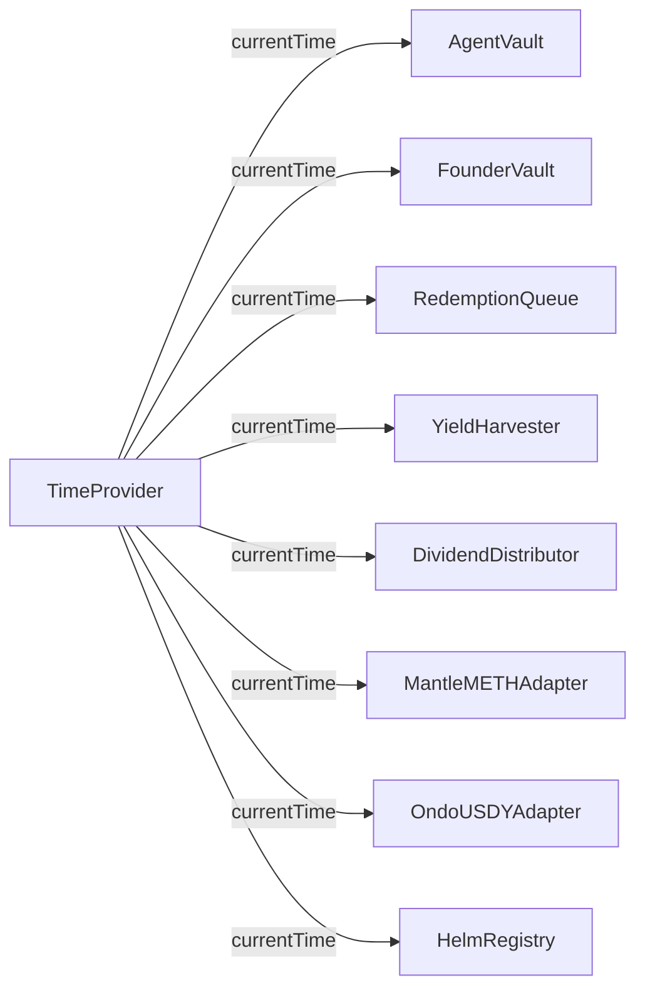

**내부 수식**:

```solidity
function currentTime() external view returns (uint256) {
    return block.timestamp + timeOffset;
}
```

**ChainId 가드** (생성 시점에 고정):

```solidity
constructor() {
    admin = msg.sender;
    devEnabled = (block.chainid == 5003 || block.chainid == 31337);
}

modifier onlyDevEnabled() {
    if (!devEnabled) revert NotDevEnabled();
    _;
}

function advance(uint256 secondsToAdd) external onlyAdmin onlyDevEnabled {
    timeOffset += secondsToAdd;
}
```

**Immutable인 이유**: 메인넷 배포 시 `devEnabled`는 영구적으로 `false`. 관리자가 탈취당해도 시간을 조작 불가. Offset은 영원히 0.

> **데모용**: `admin → timeProvider.advance(30 days)` 한 줄로 incubation, 락업, senior window를 모두 건너뜀.

### 9.2 MockUSDC mint 백스톱 (테스트넷 vs 메인넷)

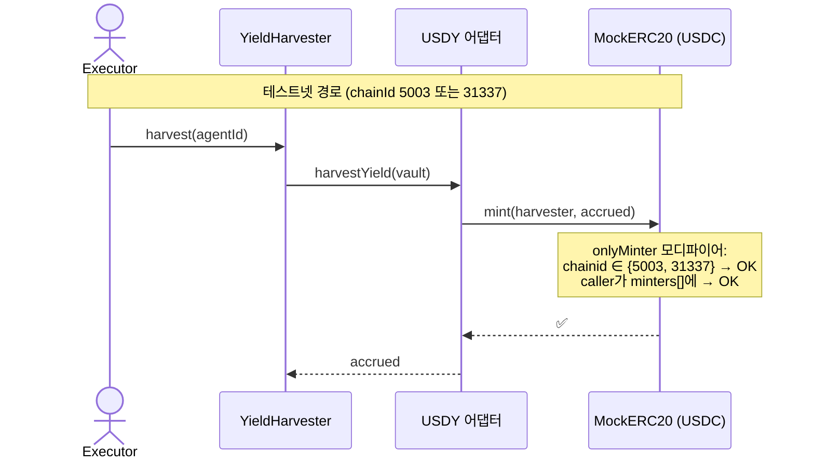

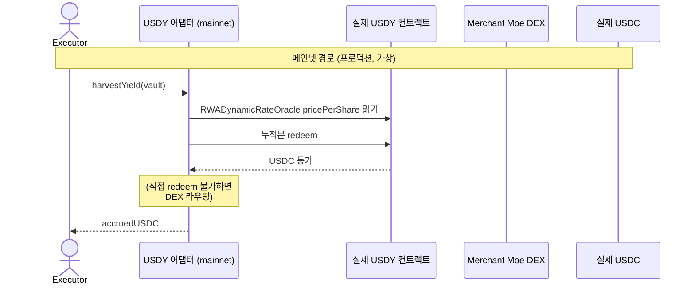

```solidity
// MockERC20.sol — chainId 가드
modifier onlyMinter() {
    if (msg.sender != minterAdmin) {
        bool testnet = block.chainid == 5003 || block.chainid == 31337;
        if (!testnet || !minters[msg.sender]) revert NotMinter();
    }
    _;
}
```

> **안전 보장**: 누군가 이 MockERC20을 메인넷에 배포하고 어댑터를 그쪽으로 가리켜도, `mint`는 non-admin 호출자에 대해 revert. `testnet == false`이기 때문. 실제 가치를 찍어낼 경로가 없음.

### 9.3 Pyth 업데이트 흐름

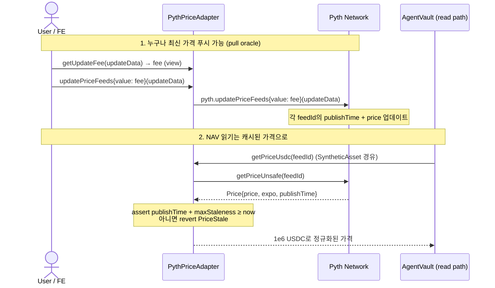

**Staleness 윈도우**:

| 피드 종류 | 최대 staleness | 근거 |
|---|---|---|
| 크립토 (ETH/USD) | 60초 | Pyth가 실제로 ~400ms마다 업데이트 |
| 주식 (NVDA, SPY, …) | 96시간 | 주식 피드는 장 중에만 발행; 주말 + 휴일로 staleness 윈도우 확대 필요 |

> **누가 업데이트 fee를 내나?** `updatePriceFeeds`를 호출하는 측. 프로덕션에서는 BE cron이 리밸런스 또는 NAV 중요 작업 전에 가격을 푸시. 데모에서는 사용자 액션과 함께 FE가 푸시 가능.

### 9.4 Clones (EIP-1167) 패턴

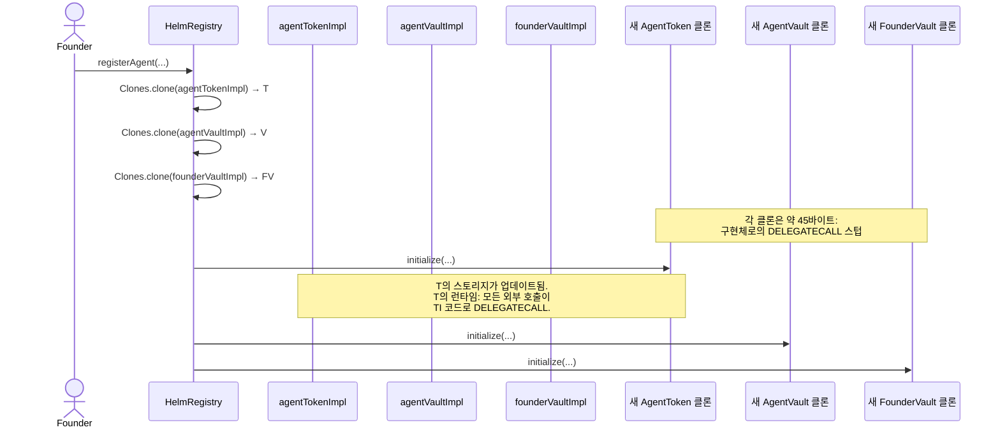

**가스 비교** (대략, `forge test` 기준):

| 방식 | 에이전트당 배포 비용 |
|---|---|
| 매번 구현체 재배포 (no clones) | ~5,500,000 gas |
| EIP-1167 클론 (현재) | ~150,000 gas |

절감: **~97%**. 또한 `HelmRegistry`가 EIP-170의 24,576바이트 런타임 바이트코드 상한 아래로 잘 유지됨 (구현체 3개를 인라인하면 초과).

### 9.5 Subordination 수학

`FounderVault.isSubordinationActive()`:

```solidity
function isSubordinationActive() external view returns (bool) {
    if (totalDeposited == 0) return false;
    return (totalWithdrawn * BPS_DENOM) / totalDeposited >= subordinationThresholdBps;
}
```

**`withdraw` 시 threshold 체크**:

```solidity
uint256 newTotalWithdrawn = totalWithdrawn + amount;
if (totalDeposited > 0) {
    uint256 withdrawnBps = (newTotalWithdrawn * 10000) / totalDeposited;
    if (withdrawnBps > subordinationThresholdBps) revert SubordinationBreached();
}
```

**계산 예시** — `subordinationThresholdBps = 4000` (40%), `totalDeposited = 200,000` AGT:

| 단계 | `totalWithdrawn` | `withdrawnBps` | 허용? |
|---|---|---|---|
| 5만 인출 | 50,000 | 2500 | ✅ |
| 추가 3만 | 80,000 | 4000 | ✅ (= threshold, > 가 아님) |
| 추가 1 AGT | 80,001 | 4000 (정수 나눗셈) | 경계; 테스트에서는 1단위 추가하면 4000.05 → revert |
| `claimCarry` 대기 (USDC, 주식 아님) | — | — | 언제나 허용 |

**큐 기반 subordination** (withdraw와 별개):

```solidity
// RedemptionQueue._checkSubordinationAndTrigger 내부
uint256 supply       = AGT.totalSupply();        // 환매로 감소
uint256 founderHeld  = FV.totalSharesHeld();     // 대체로 상수
uint256 founderBps   = founderHeld * 10000 / supply;
uint256 threshold    = FV.subordinationThresholdBps();
if (founderBps >= threshold) {
    vault.triggerWindDown("subordination_breach_via_redemption");
}
```

> **두 가지 다른 체크**:
> 1. 창업자 `withdraw`는 **누적출금 / 누적입금**을 체크. 반복 덤핑 방어.
> 2. 큐 claim은 **창업자보유 / 현재공급**을 체크. 외부 보유자의 대규모 이탈로 창업자가 지배적이 되는 상황 방어.

---

## 10. 치트시트

| 하고 싶은 일 | 호출 |
|---|---|
| **에이전트 등록** | |
| 새 에이전트 등록 | `helmRegistry.registerAgent(mandateHash, mandateURI, seedUSDC, assets, weightConstraints)` |
| Incubation에서 진행 | `helmRegistry.advanceToPublic(agentId)` (30일 경과 후) |
| **보유자 작업** | |
| 에이전트 주식 구매 | `vault.deposit(usdcAmount, receiver)` |
| 정확한 주식수 구매 | `vault.mint(shareCount, receiver)` |
| 환매 요청 | `redemptionQueue.requestRedeem(agentId, shares, LockupTier.ThirtyDay)` |
| 환매 요청 취소 | `redemptionQueue.cancel(requestId)` (unlock 1일 전까지) |
| 만기된 환매 청구 | `redemptionQueue.claim(requestId)` |
| 배당 청구 | `distributor.claim(agentId, [1, 2, 3])` (epoch ID 배열) |
| **창업자 작업** | |
| 창업자 주식 추가 입금 | `agentToken.approve(founderVault, n)` + `founderVault.depositFounderShares(n)` |
| 주식 인출 (락업 종료 후) | `founderVault.withdraw(amount)` |
| 누적 carry 청구 | `founderVault.claimCarry()` |
| Wind-down 수동 트리거 | `founderVault.triggerWindDown(reason)` |
| **BE Executor 작업** | |
| 리밸런스 실행 | `vault.executeRebalance(targetPositions, strategyProof)` |
| Yield 수확 | `yieldHarvester.harvest(agentId)` |
| Yield 소스 등록 | `yieldHarvester.registerSource(agentId, adapter, config)` |
| Yield staging + 배당 | `distributor.stageYield(agentId, amount)` + `distributor.distribute(agentId)` |
| **관리자 작업** | |
| 에이전트 슬래시 (평판) | `agentNFT.slash(agentId, amountBps, reason)` |
| Slashed phase로 강제 이동 | `helmRegistry.slash(agentId, reason)` |
| 허용 환매 티어 설정 | `redemptionQueue.setAllowedTiers(agentId, [true, true, false, false])` |
| 수집된 수수료 인출 | `treasury.withdraw(to, amount)` |
| 수수료 비율 업데이트 | `treasury.setFeeRates(mintBps, redeemBps, rebalanceBps)` |
| **Wind-down 작업** | |
| 다음 포지션 청산 | `vault.progressWindDown()` (0 반환할 때까지 반복) |
| Settlement 확정 | `vault.settle()` (senior window 종료 후) |
| **데모 / 테스트넷** | |
| 30일 빨리감기 | `timeProvider.advance(30 days)` |
| 시계 리셋 | `timeProvider.reset()` |
| 테스트넷 USDC 민트 | `mockUSDC.mint(to, amount)` (admin 전용) |
| **읽기 전용 view (FE용)** | |
| NAV per share | `vault.totalNAV() / vault.totalSupply()` |
| 총 NAV (USDC, 6-dec) | `vault.totalNAV()` |
| 현금 USDC | `vault.cashUSDC()` |
| 현재 phase | `vault.phase()` |
| 평판 점수 | `agentNFT.reputationOf(agentId)` |
| 에이전트 건강? | `agentNFT.isHealthy(agentId)` |
| 청구 가능 배당 | `distributor.pendingClaimOf(agentId, holder)` |
| 보류 중 환매 요청 | `redemptionQueue.pendingRequestsOf(holder)` |
| 수수료 비율 | `treasury.feeRates()` ((mint, redeem, rebalance) 튜플 반환) |
| 에이전트 배포 주소들 | `helmRegistry.deploymentOf(agentId)` |
| 현재 시각 | `timeProvider.currentTime()` |
| 창업자 락업 종료 | `founderVault.lockupEndsAt()` |
| 누적 출금 비율 | `founderVault.cumulativeWithdrawnBps()` |

---

## 11. 에러 디코더

### 11.1 인증 에러

| 에러 | 발생 컨트랙트 | 의미 | 해결 |
|---|---|---|---|
| `OnlyAdmin` | PlatformTreasury, HelmRegistry | 호출자가 admin이 아님 | admin EOA로 호출 |
| `NotAdmin` | TimeProvider, AgentNFT | 호출자가 admin이 아님 | admin EOA로 호출 |
| `OnlyVault` | AgentToken | 연결된 AgentVault만 호출 가능 | vault 경유로 호출 |
| `OnlyExecutor` | AgentVault, YieldHarvester | 등록된 executor가 아님 | BE executor 키 사용 |
| `OnlyHarvester` | AgentVault | YieldHarvester만 `depositYield` 호출 가능 | harvester 경유 |
| `OnlyRedemptionQueue` | AgentVault | 큐만 `fulfillRedemption` 호출 가능 | 큐 경유 |
| `OnlyRegistry` | AgentVault | HelmRegistry만 `enterPublicLaunch` 호출 가능 | registry.advanceToPublic 경유 |
| `OnlyRegisteredVault` | SyntheticAsset | 등록된 에이전트 vault만 mint/burn 가능 | admin이 `registerVault(yourVault)` 호출 필요 |
| `OnlyDistributor` | FounderVault | DividendDistributor만 `receiveCarry` 호출 가능 | distributor.distribute 경유 |
| `OnlyFounder` | FounderVault | 창업자 EOA만 호출 가능 | 창업자 키 사용 |
| `OnlyFounderDuringIncubation` | AgentVault | Incubation 중에는 창업자만 입금 가능 | PublicLaunch 대기 |
| `NotRegistry` / `NotRegistryOrAdmin` | AgentNFT | NFT mint/slash 인증 실패 | registry 또는 admin 사용 |
| `NotHarvester` | DividendDistributor | harvester만 stage/distribute 가능 | harvester 경유 |
| `NotFounder` | FounderVault | 신원 불일치 | 창업자 키 사용 |
| `NotRequestOwner` | RedemptionQueue | 타인의 요청을 claim/cancel 시도 | 원래 요청자 사용 |
| `NotVault` | HelmRegistry | `markWindDown` / `notifyMandateBreach` / `markSettled`가 등록된 vault에서 호출 안 됨 | vault 경유 |
| `NotAuthorizedToWindDown` | AgentVault | `triggerWindDown`을 founderVault/registry/queue 외에서 직접 호출 | 셋 중 하나 사용 |
| `NotDevEnabled` | TimeProvider | chainId가 5003도 31337도 아님 | 테스트넷/anvil에서만 가능 |

### 11.2 상태 / 라이프사이클 에러

| 에러 | 의미 | 해결 |
|---|---|---|
| `AlreadyAdvanced` | `advanceToPublic`이 두 번 호출됨 | no-op; 이미 incubation 지남 |
| `IncubationNotComplete(endsAt)` | 30일이 아직 경과 안 됨 | 대기 또는 `timeProvider.advance` |
| `IncubationStillActive(endsAt)` | 위와 동일 (interface 에러) | 동일 |
| `WrongPhase` | 현재 phase에서 허용 안 되는 액션 | `vault.phase()` 확인 |
| `MintsDisabled` | Vault가 wind-down 중 | wind-down 중 입금 불가 |
| `WindDownActive` | 이미 wind-down 중이라 차단 | settle 대기 |
| `WindDownNotActive` | 트리거 전에 `progressWindDown` / `settle` 호출 | 먼저 트리거 |
| `SeniorWindowOpen(endsAt)` | Senior window 중 settle / junior 환매 차단 | 시간 대기 또는 advance |
| `PositionsNotLiquidated(remaining)` | 포지션이 남은 상태에서 `settle` | 0 될 때까지 `progressWindDown` |
| `AlreadySettled` | Settle 두 번 호출 | 종료 상태 |
| `LockupActive(unlockAt)` | 락업 중 창업자 인출 | 시간 대기 또는 advance |
| `StillLocked(unlockAt)` | 만기 전 큐 claim | 시간 대기 또는 advance |
| `CancelWindowClosed` | Unlock 1일 이내 cancel 시도 | 그냥 대기 후 claim |
| `MandateLockedAfterIncubation` | Incubation 이후 mandate 변경 시도 | Launch 이후 mandate 불변 |
| `TransfersDisabled` / `TransfersFrozen` | ERC-4626 facade transfer 호출 | AgentToken 직접 사용 |
| `ERC4626RedeemDisabled` | 표준 ERC-4626 withdraw/redeem | RedemptionQueue.requestRedeem 사용 |

### 11.3 입력 / 검증 에러

| 에러 | 의미 | 해결 |
|---|---|---|
| `MandateInvalid` | Zero hash 또는 빈 URI | 유효한 mandateHash + mandateURI 제공 |
| `MandateAlreadyUsed(hash)` | mandate hash 중복 | 고유 hash 사용 |
| `InsufficientSeed` | Seed < 1000 USDC | 1000 USDC 이상 |
| `InvalidCarryBps` | `carryBps != 1000` | 정확히 1000 (10%) |
| `InvalidFounderShareBps` | [500, 3000] 범위 밖 | 5-30% (500-3000 bps) |
| `InvalidLockupDays` | `lockupDays < 90` | 90일 이상 |
| `InsufficientShares` | Supply 초과 burn / redeem | supply 확인 |
| `InsufficientCash` | 수수료/지급용 USDC 부족 | vault 충전 또는 harvest 대기 |
| `ZeroAmount` | `amount == 0`으로 호출 | 양의 값 전달 |
| `ZeroAddress` | 주소 파라미터가 `address(0)` | 유효한 주소 제공 |
| `AssetNotWhitelisted(asset)` | 화이트리스트 외 자산으로 리밸런스 | 등록 시 선언한 `assets`만 사용 |
| `MandateBreach(asset, actual, min, max)` | 리밸런스 후 가중치가 범위 밖 | `[minBps, maxBps]` 만족하도록 타겟 조정 |
| `TierNotAllowedByMandate(tier)` | 해당 락업 티어가 이 에이전트에 비활성 | admin이 `setAllowedTiers` 호출 필요 |
| `EmptyYieldPool` | 스테이지된 yield 없이 `distribute` | 먼저 stage |
| `EpochNotFinalized(agentId, epoch)` | 미확정 epoch claim 시도 | distribute 대기 |
| `AlreadyClaimed(agentId, epoch, holder)` | 이중 claim 시도 | no-op |
| `AlreadyCancelled` / `AlreadyClaimed` (queue) | 요청 상태 이미 종료 | `requestOf(id)` 확인 |
| `InvalidSlashAmount` | `amountBps == 0` 또는 `> 10000` | 1-10000 전달 |
| `InvalidPhaseTransition(from, to)` | 잘못된 전환 요청 | 상태 머신 따르기 |
| `SubordinationBreached` | 인출 시 threshold 초과 | 금액 축소 또는 vesting 대기 |

### 11.4 오라클 / 어댑터 에러

| 에러 | 의미 | 해결 |
|---|---|---|
| `PriceStale(feedId, publishTime, maxAge)` | Pyth 피드가 window 초과 | `pythAdapter.updatePriceFeeds(updateData)` 선호출 |
| `PriceNegative(feedId, raw)` | Pyth가 음수 가격 반환 (sanity check 실패) | 일시 중단; 피드 조사 |
| `UnknownFeed(feedId)` | PythPriceAdapter에 미등록 피드 | constructor 시점에만 설정; 재배포 필요 |
| `InsufficientUpdateFee(sent, required)` | `updatePriceFeeds`에 ETH 부족 | `getUpdateFee` 선호출 |
| `SlippageTooHigh(minOut, actualOut)` | 어댑터 스왑이 slippage 초과 | `minOut = 0` 또는 더 넓은 tolerance |
| `UnknownSource(source)` | 미등록 yield 소스 제거 시도 | `sourcesOf`로 확인 |
| `NonTransferable` | Synthetic 자산 transfer 시도 | 설계상 transfer 불가 |

---

## 12. 상속 및 의존성 그래프

### 12.1 상속

```mermaid
classDiagram
    class IAgentVault {
        <<interface>>
        +initialize(InitParams)
        +deposit(assets, receiver)
        +executeRebalance(targets, proof)
        +fulfillRedemption(holder, shares)
        +triggerWindDown(reason)
        +settle()
    }
    class IERC4626 {
        <<interface>>
        +asset()
        +totalAssets()
    }
    class Initializable
    class ReentrancyGuard
    class AgentVault {
        +phase
        +totalNAV()
        +cashUSDC()
        +yieldPool
    }
    IAgentVault --|> IERC4626
    AgentVault ..|> IAgentVault
    AgentVault --|> Initializable
    AgentVault --|> ReentrancyGuard

    class ERC20Upgradeable
    class IAgentToken {
        <<interface>>
    }
    class AgentToken
    AgentToken --|> ERC20Upgradeable
    AgentToken ..|> IAgentToken

    class IFounderVault {
        <<interface>>
    }
    class FounderVault
    FounderVault ..|> IFounderVault
    FounderVault --|> Initializable
    FounderVault --|> ReentrancyGuard

    class ERC721
    class AgentNFT {
        +reputationScore
        +slash()
    }
    AgentNFT --|> ERC721

    class IHelmRegistry {
        <<interface>>
    }
    class HelmRegistry
    HelmRegistry ..|> IHelmRegistry

    class ISyntheticAsset {
        <<interface>>
    }
    class SyntheticAsset
    SyntheticAsset ..|> ISyntheticAsset
    SyntheticAsset --|> ReentrancyGuard

    class IPyth {
        <<external>>
    }
    class IPythPriceAdapter {
        <<interface>>
    }
    class PythPriceAdapter
    PythPriceAdapter ..|> IPythPriceAdapter

    class IMantleMETHAdapter {
        <<interface>>
    }
    class MantleMETHAdapter
    MantleMETHAdapter ..|> IMantleMETHAdapter

    class IOndoUSDYAdapter {
        <<interface>>
    }
    class OndoUSDYAdapter
    OndoUSDYAdapter ..|> IOndoUSDYAdapter

    class IRedemptionQueue {
        <<interface>>
    }
    class RedemptionQueue
    RedemptionQueue ..|> IRedemptionQueue
    RedemptionQueue --|> ReentrancyGuard

    class IYieldHarvester {
        <<interface>>
    }
    class YieldHarvester
    YieldHarvester ..|> IYieldHarvester
    YieldHarvester --|> ReentrancyGuard

    class IDividendDistributor {
        <<interface>>
    }
    class DividendDistributor
    DividendDistributor ..|> IDividendDistributor
    DividendDistributor --|> ReentrancyGuard

    class IPlatformTreasury {
        <<interface>>
    }
    class PlatformTreasury
    PlatformTreasury ..|> IPlatformTreasury

    class ITimeProvider {
        <<interface>>
    }
    class TimeProvider
    TimeProvider ..|> ITimeProvider
```

### 12.2 인터페이스 의존성 그래프

어떤 컨트랙트가 어떤 인터페이스에 의존하나 (읽기 또는 호출):

```mermaid
flowchart TB
    R[HelmRegistry] --> IAV[IAgentVault]
    R --> IAT[IAgentToken]
    R --> IFV[IFounderVault]
    R --> ITP[ITimeProvider]
    R --> NFT[AgentNFT struct 사용]

    V[AgentVault] --> IAT
    V --> IFV
    V --> IPT[IPlatformTreasury]
    V --> ISY[ISyntheticAsset]
    V --> IME[IMantleMETHAdapter]
    V --> IUY[IOndoUSDYAdapter]
    V --> ITP

    FV[FounderVault] --> IAT
    FV --> IAV
    FV --> ITP

    Q[RedemptionQueue] --> IAV
    Q --> IAT
    Q --> IFV
    Q --> IHR[IHelmRegistry]
    Q --> ITP

    H[YieldHarvester] --> IAV
    H --> IHR
    H --> IME
    H --> IUY
    H --> ITP

    D[DividendDistributor] --> IHR
    D --> IFV
    D --> ITP

    SY[SyntheticAsset] --> PA[PythPriceAdapter 직접]

    ME[MantleMETHAdapter] --> ITP
    ME --> IPyth[IPyth - 외부]
    UY[OndoUSDYAdapter] --> ITP
    PA --> IPyth

    classDef iface fill:#fef3c7,stroke:#a16207,color:#78350f
    class IAV,IAT,IFV,IPT,ISY,IME,IUY,ITP,IHR,IPyth iface
```

### 12.3 외부 라이브러리 의존성

| 라이브러리 | 사용처 | 용도 |
|---|---|---|
| `@openzeppelin/contracts/token/ERC20/IERC20.sol` | 모든 USDC 흐름 | 표준 ERC-20 |
| `@openzeppelin/contracts/token/ERC20/utils/SafeERC20.sol` | 모든 transfer | 재진입 안전 transfer + 비표준 토큰 처리 |
| `@openzeppelin/contracts/proxy/Clones.sol` | HelmRegistry | EIP-1167 미니멀 프록시 |
| `@openzeppelin/contracts/proxy/utils/Initializable.sol` | AgentVault, FounderVault | 클론에서 사용할 생성자 대체 |
| `@openzeppelin/contracts/token/ERC721/ERC721.sol` | AgentNFT | NFT 베이스 |
| `@openzeppelin/contracts/utils/ReentrancyGuard.sol` | AgentVault, FounderVault, SyntheticAsset, RedemptionQueue, YieldHarvester, DividendDistributor | 재진입 방어 |
| `@openzeppelin/contracts/interfaces/IERC4626.sol` | IAgentVault | ERC-4626 surface |
| `@openzeppelin-upgradeable/token/ERC20/ERC20Upgradeable.sol` | AgentToken | 업그레이더블 ERC-20 (클론용) |
| `@pyth-sdk-solidity/IPyth.sol` | PythPriceAdapter, MantleMETHAdapter | Pyth pull oracle |
| `@pyth-sdk-solidity/PythStructs.sol` | PythPriceAdapter, MantleMETHAdapter | Pyth 가격 struct |

---

## 부록 — 신규 컨트리뷰터 추천 학습 순서

코드베이스가 처음이라면 이 순서대로 읽기 권장:

1. **[IDEA.md](../IDEA.md)** — 비즈니스 스펙, 결정사항, REIT 모델 근거.
2. **[CLAUDE.md](../CLAUDE.md)** — 코딩 컨벤션, 하드 제약, 명명 규칙.
3. **[src/interfaces/](../src/interfaces/)** — 14개 인터페이스를 먼저 모두 읽고 public surface 파악 (구현 노이즈 없이).
4. **[src/system/TimeProvider.sol](../src/system/TimeProvider.sol)** — 가장 작은 컨트랙트, 단일 개념.
5. **[src/system/AgentNFT.sol](../src/system/AgentNFT.sol)** — 싱글톤 ERC-721, 평판.
6. **[src/core/AgentToken.sol](../src/core/AgentToken.sol)** — 최소 클론 ERC-20.
7. **[src/system/PlatformTreasury.sol](../src/system/PlatformTreasury.sol)** — 수수료 회계.
8. **[src/adapters/PythPriceAdapter.sol](../src/adapters/PythPriceAdapter.sol)** — staleness 포함 오라클 래퍼.
9. **[src/adapters/SyntheticAsset.sol](../src/adapters/SyntheticAsset.sol)** — Pyth 가격 추종 주식 토큰.
10. **[src/adapters/OndoUSDYAdapter.sol](../src/adapters/OndoUSDYAdapter.sol)** — 가장 단순한 yield 어댑터.
11. **[src/adapters/MantleMETHAdapter.sol](../src/adapters/MantleMETHAdapter.sol)** — Pyth ETH/USD 레이어 추가.
12. **[src/core/FounderVault.sol](../src/core/FounderVault.sol)** — 클론, 락업 + subordination + carry.
13. **[src/core/AgentVault.sol](../src/core/AgentVault.sol)** — ⭐ 핵심 컨트랙트, 나머지 다 읽은 후 마지막에.
14. **[src/system/RedemptionQueue.sol](../src/system/RedemptionQueue.sol)** — AgentVault, FounderVault 사용.
15. **[src/yield/YieldHarvester.sol](../src/yield/YieldHarvester.sol)** — 어댑터 루프.
16. **[src/yield/DividendDistributor.sol](../src/yield/DividendDistributor.sol)** — Epoch 기반 비례 분배.
17. **[src/system/HelmRegistry.sol](../src/system/HelmRegistry.sol)** — 마지막에 팩토리 오케스트레이터.
18. **[test/IntegrationTest.t.sol](../test/IntegrationTest.t.sol)** — 위 모든 것을 종합한 end-to-end 플로우.

---

*아키텍처 가이드 종료. 배포 상황은 [CONTRACT_STATUS.md](CONTRACT_STATUS.md), 비즈니스 결정은 [IDEA.md](../IDEA.md) 참고.*
