# Helm — Smart Contract Architecture Guide

> **Audience**: the project author + BE/FE teammates ramping up.
> **Goal**: understand *structure*, not *status*. For "what's done / what's pending", see [CONTRACT_STATUS.md](CONTRACT_STATUS.md).
>
> This guide is heavy on mermaid diagrams, sequence flows, permission matrices, and concrete numeric scenarios. Read top-to-bottom on first pass; use Sections 6/10/11 as reference afterward.

---

## Table of contents

1. [System Map](#1-system-map)
2. [Per-agent vs system-wide](#2-per-agent-vs-system-wide)
3. [Lifecycle phase machine](#3-lifecycle-phase-machine)
4. [Sequence diagrams — key flows](#4-sequence-diagrams)
5. [Money flow — concrete scenarios](#5-money-flow)
6. [Permission matrix](#6-permission-matrix)
7. [Storage layout per contract](#7-storage-layout)
8. [Event flow per scenario](#8-event-flow)
9. [Cross-cutting concerns](#9-cross-cutting-concerns)
10. [Cheat sheet](#10-cheat-sheet)
11. [Common errors decoded](#11-common-errors)
12. [Inheritance & dependency graph](#12-inheritance--dependency)

---

## 1. System Map

The whole system on one screen. Solid arrows are state-changing calls; dashed arrows are reads.

```mermaid
flowchart TB
    %% ─── External actors ───────────────────────────────────────────
    subgraph Actors[" "]
        direction LR
        Founder([Founder])
        Holder([Holder])
        BE([BE Executor / Indexer])
        Admin([Admin])
    end

    %% ─── On-chain singletons ───────────────────────────────────────
    subgraph Sys[System singletons]
        direction TB
        Reg[HelmRegistry]
        NFT[AgentNFT - ERC-721]
        TP[TimeProvider]
        Treas[PlatformTreasury]
        Q[RedemptionQueue]
    end

    subgraph Yield[Yield singletons]
        direction TB
        H[YieldHarvester]
        D[DividendDistributor]
    end

    subgraph Adapters[Adapter singletons]
        direction TB
        Pyth[PythPriceAdapter]
        ME[MantleMETHAdapter]
        UY[OndoUSDYAdapter]
        SY1[SyntheticAsset - sNVDA]
        SYn[SyntheticAsset - sSPY/sAAPL/sTSLA/sMSFT]
    end

    %% ─── Per-agent clones (one trio per agent) ─────────────────────
    subgraph Clones[Per-agent clones - EIP-1167]
        direction TB
        Tok[AgentToken]
        V[AgentVault]
        FV[FounderVault]
    end

    %% ─── External / off-chain ──────────────────────────────────────
    subgraph Ext[External]
        direction TB
        PythNet[(Pyth Network)]
        USDC[(USDC ERC-20)]
        mETHReal[(Mantle mETH real proxy)]
    end

    %% ─── Calls ─────────────────────────────────────────────────────
    Founder -->|registerAgent| Reg
    Holder -->|deposit / requestRedeem / claim| V
    Holder -->|claim| D
    Holder -->|requestRedeem / claim| Q
    BE -->|executeRebalance| V
    BE -->|harvest / distribute| H
    Admin -->|setAllowedTiers / setFeeRate / advance| Reg
    Admin -->|setFeeRate| Treas
    Admin -->|setAllowedTiers| Q
    Admin -->|advance / reset| TP

    Reg -->|clone + initialize| Tok
    Reg -->|clone + initialize| V
    Reg -->|clone + initialize| FV
    Reg -->|mint| NFT
    Reg -.->|markWindDown / notifyMandateBreach| NFT

    V -->|mint / burn| Tok
    V -->|mint/burn synth| SY1
    V -->|deposit/redeem| ME
    V -->|deposit/redeem| UY
    V -->|collectFee + transfer| Treas
    V -.->|valueInUSDC| ME
    V -.->|valueInUSDC| UY
    V -.->|priceUSDC| SY1
    V -.->|currentTime| TP

    Q -->|fulfillRedemption| V
    Q -.->|deploymentOf| Reg
    Q -.->|currentTime| TP

    H -->|harvestYield| ME
    H -->|harvestYield| UY
    H -->|depositYield| V
    H -.->|deploymentOf| Reg

    D -->|receiveCarry| FV
    D -.->|deploymentOf| Reg

    FV -->|triggerWindDown| V
    FV -.->|currentTime| TP

    SY1 -.->|getPriceUsdc| Pyth
    Pyth -.->|getPriceUnsafe| PythNet
    ME -.->|getPriceUnsafe ETH/USD| PythNet
    ME -.->|reference only| mETHReal

    V -.->|USDC asset| USDC
    Treas -.->|holds| USDC
    FV -.->|holds USDC carry| USDC
    H -.->|forwards USDC| USDC
    D -.->|holds staged USDC| USDC

    classDef singleton fill:#dbeafe,stroke:#1e40af,color:#1e3a8a
    classDef clone     fill:#dcfce7,stroke:#15803d,color:#14532d
    classDef external  fill:#e5e7eb,stroke:#374151,color:#111827
    classDef actor     fill:#fed7aa,stroke:#c2410c,color:#7c2d12
    class Reg,NFT,TP,Treas,Q,H,D,Pyth,ME,UY,SY1,SYn singleton
    class Tok,V,FV clone
    class PythNet,USDC,mETHReal external
    class Founder,Holder,BE,Admin actor
```

**Reading the colors**:

- 🟦 **Blue** = system singleton (deployed once, shared across all agents)
- 🟩 **Green** = per-agent clone (EIP-1167 minimal proxy, one trio per agent)
- ⬜ **Gray** = external contract or token (not deployed by us)
- 🟧 **Orange** = off-chain actor

> **NOTE**: `SyntheticAsset` is a singleton **per asset** (sNVDA, sSPY, sAAPL, sTSLA, sMSFT each get their own instance). One contract per equity, shared by all agents that whitelist it.

---

## 2. Per-agent vs system-wide

### What gets cloned when an agent is registered

When `HelmRegistry.registerAgent(...)` runs, **3 EIP-1167 minimal-proxy clones** are deployed. Each agent gets its own trio.

```
┌─────────────────────────────────────────────────────────────────┐
│                  PER AGENT (cloned, EIP-1167)                    │
│                                                                  │
│   ┌──────────────┐    ┌──────────────┐    ┌──────────────────┐  │
│   │  AgentToken  │◄──►│  AgentVault  │◄──►│  FounderVault    │  │
│   │  (ERC-20)    │    │  (ERC-4626)  │    │  (custody)       │  │
│   └──────────────┘    └──────────────┘    └──────────────────┘  │
│         AGT-1               vault-1            founderVault-1    │
└─────────────────────────────────────────────────────────────────┘

                   shared by ALL agents

┌─────────────────────────────────────────────────────────────────┐
│            SYSTEM-WIDE SINGLETONS (deployed once)                │
│                                                                  │
│  HelmRegistry      AgentNFT           TimeProvider               │
│  PlatformTreasury  RedemptionQueue    YieldHarvester             │
│  DividendDistributor                                             │
│                                                                  │
│  PythPriceAdapter  MantleMETHAdapter  OndoUSDYAdapter            │
│  SyntheticAsset × 5  (sNVDA, sSPY, sAAPL, sTSLA, sMSFT)          │
└─────────────────────────────────────────────────────────────────┘
```

### Why this split?

- **Singletons** hold cross-agent state (reputation, fees, queues, prices) and constants. Deploying once saves gas and keeps the surface auditable.
- **Clones** hold per-agent state (NAV, holders, mandate). EIP-1167 minimal proxies are ~45 bytes of bytecode and ~150k gas to deploy, vs. ~5M+ gas if we re-deployed the full implementations.

### Implementation contracts vs clones

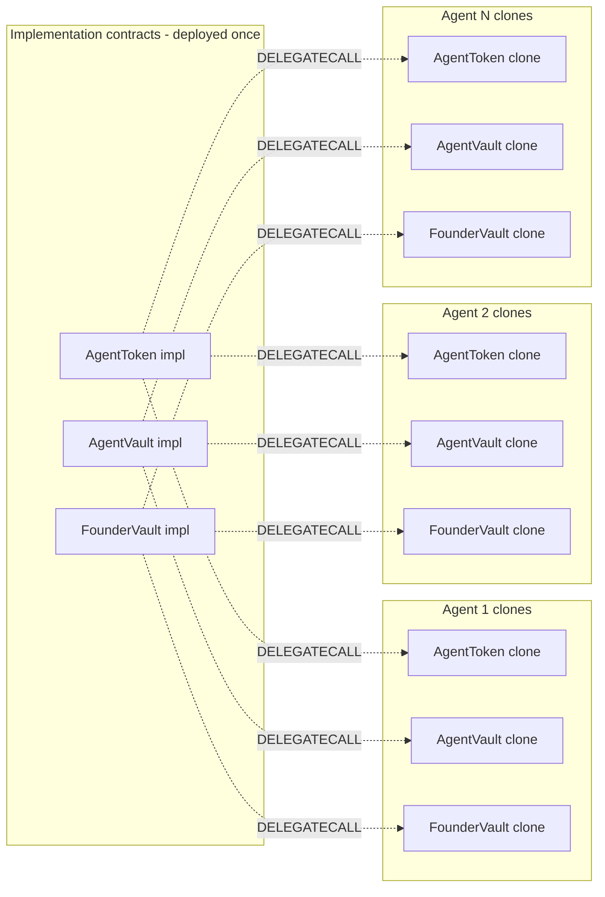

Each clone has its own storage slots but executes the implementation's logic. The implementation's constructor calls `_disableInitializers()` so the implementation itself can never be initialized — only clones can.

---

## 3. Lifecycle phase machine

`AgentVault.phase` is the master state. Every external action checks the current phase.

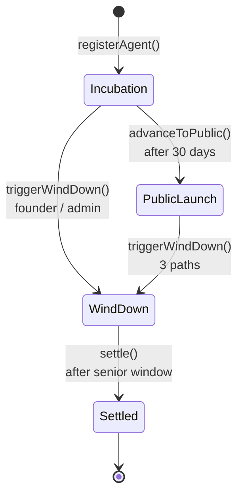

### Transitions in detail

| From | To | Function | Caller | Preconditions | Events |
|---|---|---|---|---|---|
| `[init]` | `Incubation` | `HelmRegistry.registerAgent` | Founder | seed ≥ 1000 USDC; mandateHash unused; mandateURI non-empty | `AgentRegistered`, `AgentNFTMinted`, `SharesDeposited` |
| `Incubation` | `PublicLaunch` | `HelmRegistry.advanceToPublic` | Anyone | `now ≥ incubationStart + 30 days` | `PhaseAdvanced(Incubation, PublicLaunch)`, `PhaseChanged` |
| `Incubation` / `PublicLaunch` | `WindDown` | `AgentVault.triggerWindDown` | FounderVault / Registry / Queue | `!windDown.active` | `WindDownTriggered`, `PhaseChanged`, `AgentWindDown`, `ReputationSlashed(2000 bps)` |
| `WindDown` | `Settled` | `AgentVault.settle` | Anyone | `now ≥ seniorWindowEnd`; all positions liquidated | `Settled`, `PhaseChanged`, `AgentSettled` |

> **NOTE**: `Phase.Slashed` exists on `IHelmRegistry` for admin-forced kill, but the production path uses wind-down + reputation slash via `markWindDown`. The vault never enters a `Slashed` state directly.

### Mints-allowed matrix per phase

| Phase | Founder deposit | Public deposit | Redeem (via queue) | Rebalance | Yield harvest | Wind-down operations |
|---|---|---|---|---|---|---|
| `Incubation` | ✅ | ❌ (`OnlyFounderDuringIncubation`) | ✅ | ✅ | ✅ | only `triggerWindDown` |
| `PublicLaunch` | ✅ | ✅ | ✅ | ✅ | ✅ | only `triggerWindDown` |
| `WindDown` | ❌ (`MintsDisabled`) | ❌ | senior only during window | ❌ (`WindDownActive`) | n/a | `progressWindDown`, `settle` |
| `Settled` | ❌ | ❌ | ❌ | ❌ | ❌ | terminal |

---

## 4. Sequence diagrams

### 4.1 Agent registration

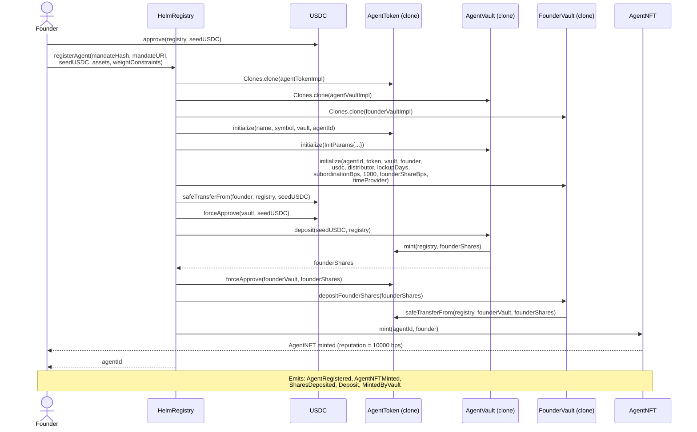

### 4.2 Mint during PublicLaunch

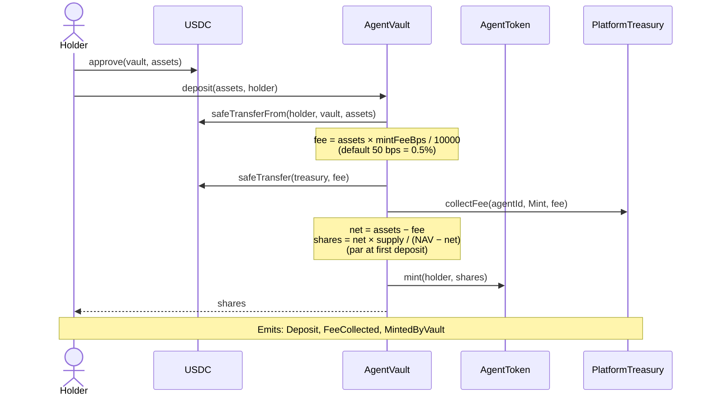

### 4.3 Rebalance

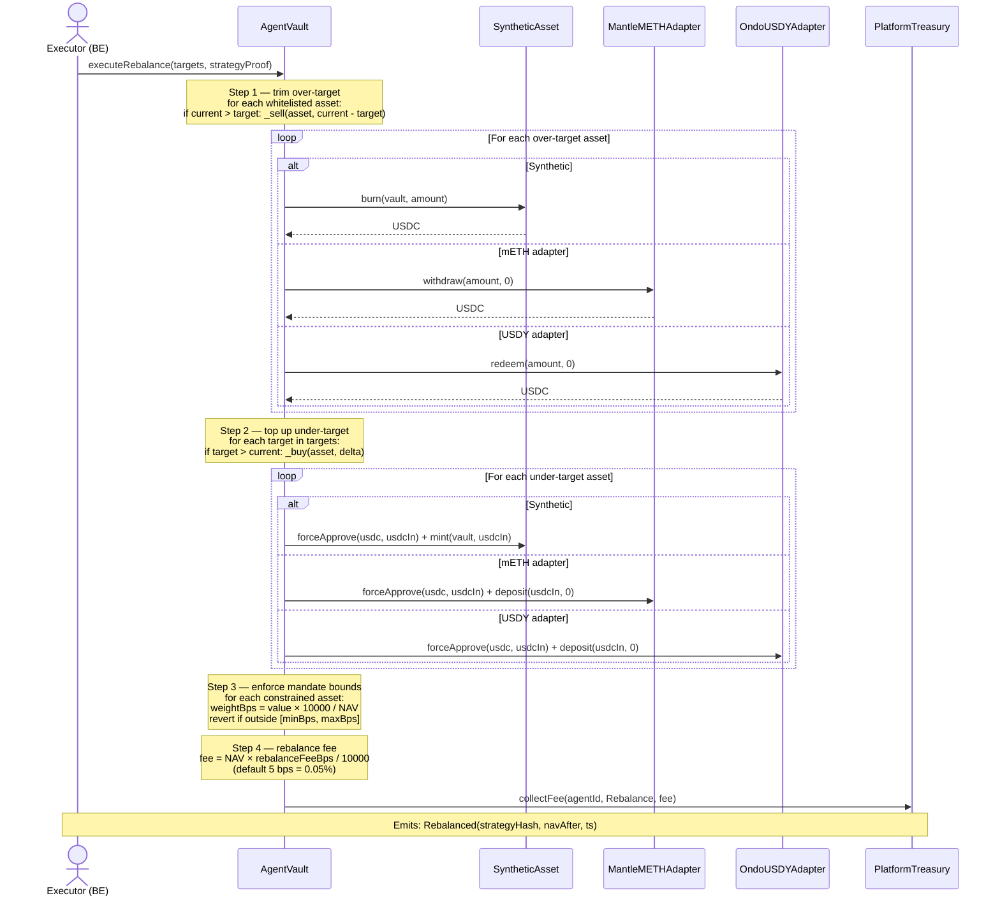

> **NOTE**: If step 3 reverts, the BE indexer detects the failed tx and calls `HelmRegistry.notifyMandateBreach` via the vault, which slashes the AgentNFT by 1000 bps. The revert + slash are not atomic by design — see [Section 4.10](#410-mandate-breach).

### 4.4 Yield harvest + dividend distribution

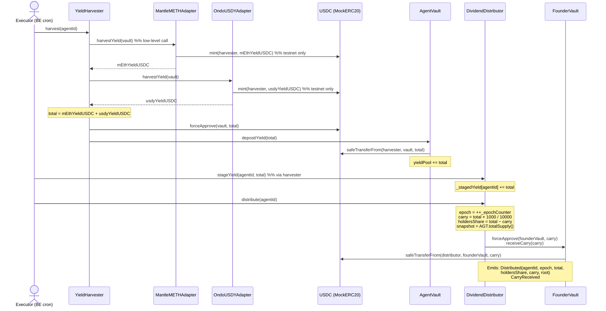

### 4.5 Holder claims dividend

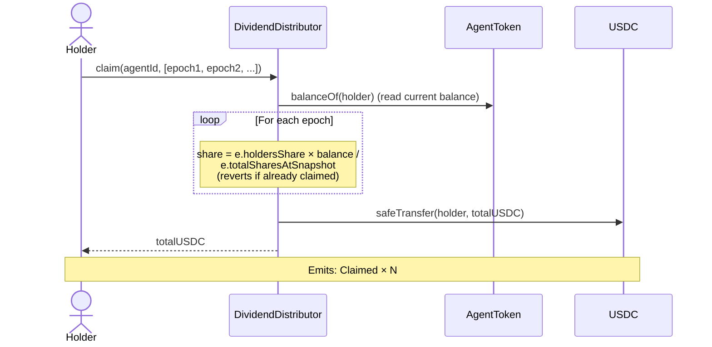

### 4.6 Redemption with 30-day lockup

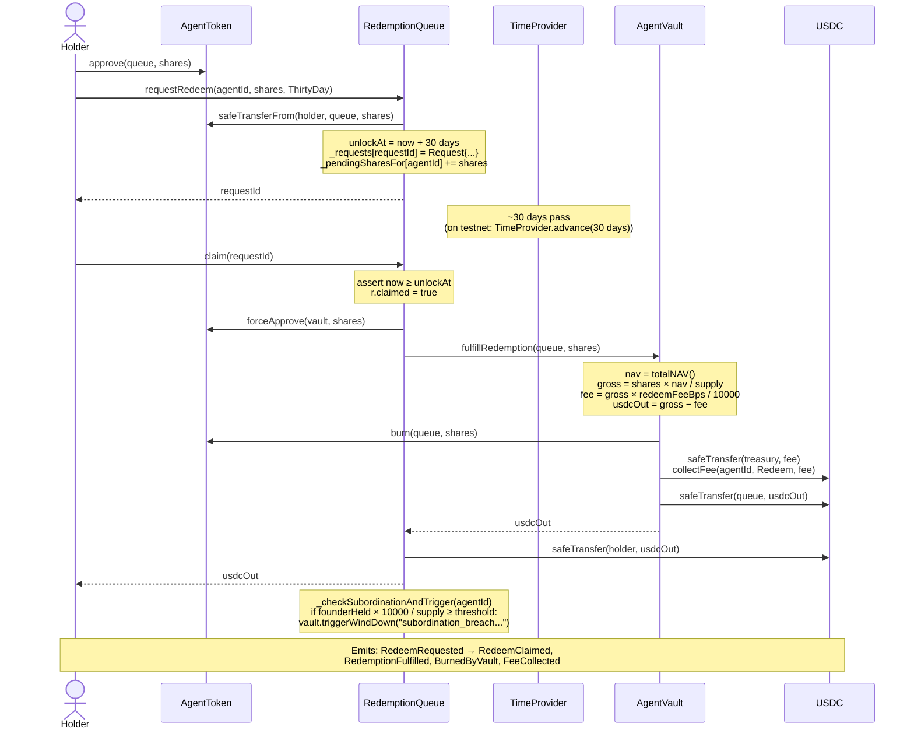

### 4.7 Wind-down trigger 1 (founder manual)

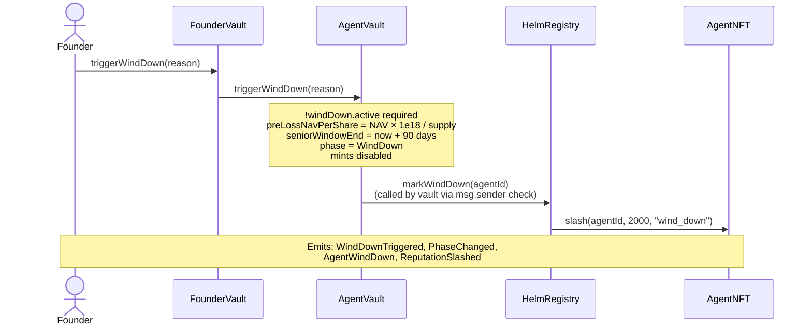

### 4.8 Wind-down trigger 2 (subordination breach via redemption)

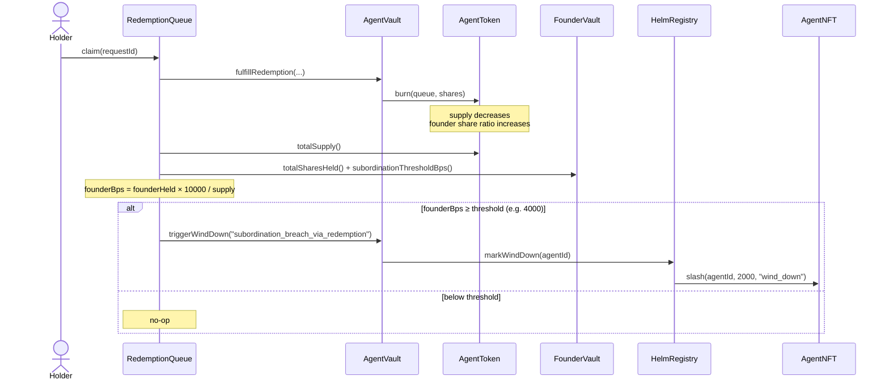

> **Why this auto-trigger?** As outside holders redeem, the founder's *effective* stake of remaining supply rises. Once it exceeds `subordinationThresholdBps`, the founder is no longer subordinated — they'd dominate any further redemption. The auto-trigger forces wind-down so seniors still standing get pre-loss-NAV priority before that protection erodes.

### 4.9 Wind-down progression and settlement

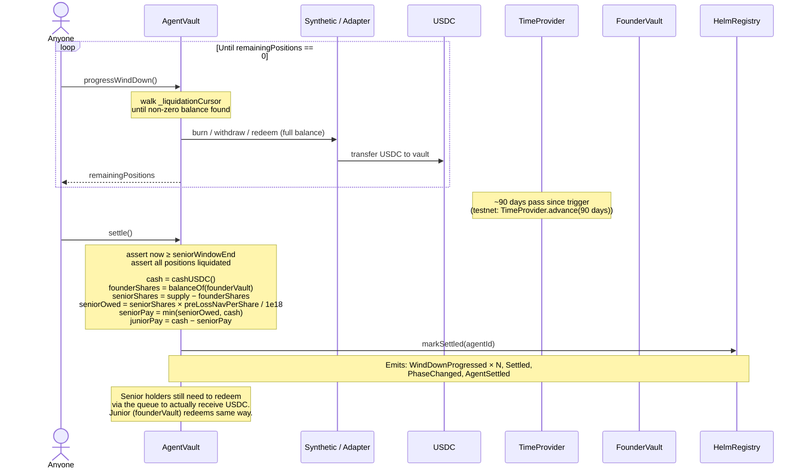

### 4.10 Mandate breach

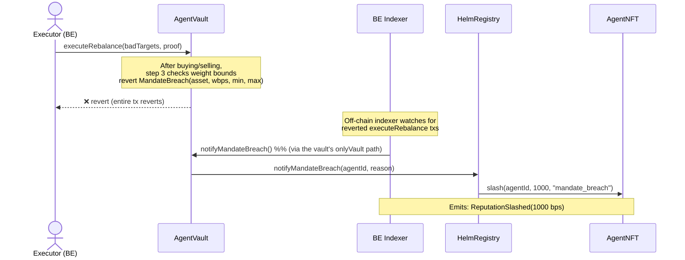

> **Design note**: a single tx cannot both revert the rebalance *and* atomically record the slash — the slash state change would be reverted too. So the indexer relays the breach back through a separate tx. This is acknowledged in `AgentVault.executeRebalance` NatSpec.

---

## 5. Money flow — concrete scenarios

All amounts in USDC (6 decimals) unless noted. AGT shares are 18 decimals. mETH and USDY balances are 18 decimals.

### 5.1 Founder registers agent with 1000 USDC seed

**Before** — `defaultLockupDays = 180`, `defaultSubordinationBps = 4000`, `defaultFounderShareBps = 2000`:

| Holder | USDC | AGT |
|---|---|---|
| Founder EOA | 1,000.000000 | 0 |
| HelmRegistry | 0 | 0 |
| AgentVault (about to deploy) | 0 | 0 |
| FounderVault (about to deploy) | 0 | 0 |

**Steps**:

1. `USDC.approve(registry, 1000e6)`
2. `registry.registerAgent(mandateHash, mandateURI, 1000e6, assets, constraints)`

**After**:

| Holder | USDC | AGT |
|---|---|---|
| Founder EOA | 0 | 0 |
| AgentVault | **1,000.000000** | 0 |
| FounderVault | 0 | **1,000.000000000000000000** (1000 × 1e18) |
| AgentNFT | — | — (NFT #1 held by founder, reputation = 10000 bps) |

Founder's AGT is custodied in FounderVault under a 180-day lockup. Founder cannot withdraw or transfer it during that window.

> **NOTE**: Mint fee does not apply on the registration deposit because it's routed through registry → vault.deposit(receiver=registry), and the vault charges fee on any deposit including this one. Actual breakdown: 5 USDC (0.5%) goes to Treasury and 995 USDC stays in vault. **The 1000 / 1000 numbers above are approximate**; precise net is 995 USDC vault, 5 USDC treasury. See [§5.2](#52-holder-mints-1000-usdc-during-public-launch) for the fee math.

### 5.2 Holder mints 1000 USDC during PublicLaunch

**Setup**: NAV = 1.0 USDC/AGT, supply = 1000 AGT (just the founder).

**Before**:

| Account | USDC | AGT |
|---|---|---|
| Holder | 1,000 | 0 |
| AgentVault | 995 | 0 |
| Treasury | 5 | 0 |

**Steps**:

1. `USDC.approve(vault, 1000e6)`
2. `vault.deposit(1000e6, holder)`

**Inside `deposit`**:

```
fee     = 1000e6 × 50 / 10000 = 5e6 USDC (0.5%)
net     = 1000e6 − 5e6 = 995e6 USDC
nav     = 995 (USDC currently held; updated mid-call after transferIn)
supply  = 1000e18
navBefore = nav - net = 0 (deposit pulled in, but NAV-before = current minus net)
        — actually navBefore handles edge case
shares  = net × supply / navBefore (with edge-case at supply==0 or navBefore==0)
```

Realistic path with supply > 0 and NAV ≠ 0 before this deposit (founder shares already exist at NAV = 1.0):

```
nav (after pull, before share mint) = 1995e6
net = 995e6
navBefore = 1995e6 - 995e6 = 1000e6
shares = 995e6 × 1000e18 / 1000e6 = 995e18 AGT
```

**After**:

| Account | USDC | AGT |
|---|---|---|
| Holder | 0 | **995** |
| AgentVault | 1,990 | 0 |
| Treasury | 10 | 0 |
| FounderVault | 0 | 1,000 |
| **Total supply** | — | **1,995** |
| **NAV per share** | — | **1990 / 1995 = 0.99749 USDC/AGT** |

NAV/share dropped 0.25% because the holder paid the mint fee — that's the diluted price holders bear on entry.

### 5.3 Monthly yield harvest + distribution

**Setup**:
- Vault holds 100,000 USDY (deposited via Ondo adapter, accruing at 5% APY)
- Vault holds 50,000 USDC-equivalent of mETH (Mantle adapter, accruing at 4% APY)
- 30 days have elapsed since last harvest
- AGT supply = 100,000 (split: founder 20k, holder A 60k, holder B 20k)

**Step A — Yield accrual at adapters (continuous, no tx needed)**:

```
USDY accrual:
  delta_30d = 5% × 30/365 = 0.4109589 %
  USDY value increase = 100,000 × 0.004109589 = 410.96 USDC

mETH accrual:
  delta_30d = 4% × 30/365 = 0.3287671 %
  mETH value increase = 50,000 × 0.003287671 = 164.38 USDC

Total accrued yield: 575.34 USDC
```

**Step B — `harvester.harvest(agentId)` is called**:

| Action | Account changed | Delta |
|---|---|---|
| `usdyAdapter.harvestYield(vault)` | USDC.mint(harvester, 410.96) | +410.96 |
| `mEthAdapter.harvestYield(vault)` | USDC.mint(harvester, 164.38) | +164.38 |
| `vault.depositYield(575.34)` | USDC: harvester → vault | −575.34 → +575.34 |
| `vault.yieldPool += 575.34` | — | yieldPool = 575.34 |

> **NOTE**: The MockERC20 mint here is **testnet-only**. On mainnet, the adapter would route through a real swap path to convert mETH/USDY rewards to USDC. The chainId guard in `MockERC20.onlyMinter` blocks accidental mainnet mints.

**Step C — `distributor.distribute(agentId)` is called**:

```
carry        = 575.34 × 1000 / 10000 = 57.534 USDC (10%)
holdersShare = 575.34 − 57.534      = 517.806 USDC (90%)
snapshot     = AGT.totalSupply()    = 100,000
epoch        = 1
```

USDC flows:
- 57.534 → FounderVault.carryBalance
- 517.806 stays in Distributor, waiting to be claimed

**Step D — Holders claim**:

| Holder | AGT balance | Claim amount | Computation |
|---|---|---|---|
| Founder (via founderVault) | 20,000 | 103.5612 | 517.806 × 20000 / 100000 |
| Holder A | 60,000 | 310.6836 | 517.806 × 60000 / 100000 |
| Holder B | 20,000 | 103.5612 | 517.806 × 20000 / 100000 |
| **Sum** | 100,000 | **517.806** | ✅ |

Plus, founder calls `founderVault.claimCarry()` → +57.534 USDC.

**Founder net per month**: 103.5612 (pro-rata as a holder) + 57.534 (carry) = **161.10 USDC**.

> **NOTE**: The founder is the only holder who's both a senior holder (via FounderVault's AGT balance) AND a carry recipient. They get pro-rata 90% PLUS the 10% carry on their carrying. The math intentionally gives the founder skin-in-the-game *and* an incentive layer.

### 5.4 Redeem 500 AGT after 30-day lockup

**Setup**: NAV per share = 1.0 USDC, supply = 100,000 AGT, vault cash = 100,000 USDC.

**Before** (Holder A):

| Account | USDC | AGT |
|---|---|---|
| Holder A | 0 | 60,000 |
| Queue | 0 | 0 |
| Vault | 100,000 | 0 |
| Treasury | 0 | 0 |

**Steps**:

1. `AGT.approve(queue, 500e18)`
2. `queue.requestRedeem(agentId, 500e18, ThirtyDay)` — AGT moves to queue, `unlockAt = now + 30 days`

After request:

| Account | USDC | AGT |
|---|---|---|
| Holder A | 0 | 59,500 |
| Queue | 0 | 500 |
| Vault | 100,000 | — |

3. *(30 days pass, or `timeProvider.advance(30 days)` on testnet)*
4. `queue.claim(requestId)`

**Inside `claim`**:

```
nav       = 100,000 USDC
supply    = 100,000 AGT
gross     = 500 × 100,000 / 100,000 = 500 USDC
fee       = 500 × 50 / 10000        = 2.5 USDC (0.5%)
usdcOut   = 500 − 2.5               = 497.5 USDC
```

**After**:

| Account | USDC | AGT |
|---|---|---|
| Holder A | **497.5** | 59,500 |
| Queue | 0 | 0 |
| Vault | **99,500** | — |
| Treasury | **2.5** | — |
| **Total supply** | — | **99,500** |

NAV/share unchanged at 1.0 USDC because we burned shares and paid USDC proportionally.

### 5.5 Wind-down with 20% loss

**Setup**:
- Pre-loss: vault holds 1,000,000 USDC, supply = 1,000,000 AGT, NAV/share = 1.0
- Founder owns 200,000 AGT (20%) custodied in FounderVault; outside holders own 800,000 AGT
- Founder hits `withdraw(100k)` — cumulative withdrawn now 100k / 200k = 50% > `subordinationThresholdBps = 4000` (40%) → revert

Instead, let's say a market crash drops NAV 20%, then founder manually triggers wind-down.

**Step A — At trigger time**:

```
totalNAV    = 800,000 USDC (after 20% loss)
supply      = 1,000,000 AGT
preLossNavPerShare = 800,000 × 1e18 / 1,000,000 = 0.8 × 1e18 = 0.8 USDC/AGT
seniorWindowEnd = now + 90 days
```

**Step B — Positions get liquidated to USDC (`progressWindDown` loop)**:

Let's say after all sells, total cash = 790,000 USDC (another 1.25% slippage during fire sale, but the math handles this).

**Step C — Senior window passes, anyone calls `settle()`**:

```
cash = 790,000 USDC
founderShares = 200,000 AGT
seniorShares  = 1,000,000 − 200,000 = 800,000 AGT
seniorOwed    = 800,000 × 0.8 × 1e18 / 1e18 = 640,000 USDC
seniorPay     = min(640,000, 790,000) = 640,000 USDC
juniorPay     = 790,000 − 640,000 = 150,000 USDC
```

**Result table** (per share):

| Tranche | Shares | NAV/share before | Paid out | Effective NAV/share | Loss |
|---|---|---|---|---|---|
| Senior (outside) | 800,000 | 1.000 | 640,000 | 0.800 | −20% (exactly the market loss) |
| Junior (founder) | 200,000 | 1.000 | 150,000 | 0.750 | −25% (absorbed extra 5% slippage) |

> **Senior is protected at pre-loss-NAV (0.8 USDC/AGT)**. Junior absorbs any further losses incurred during the liquidation window. This is the rug-pull defense: founder cannot dump and leave outsiders holding the bag.

**Worse-case (deeper loss)**:

If cash after liquidation = 500,000 USDC (only 62.5% of pre-loss NAV):

```
seniorPay = min(640,000, 500,000) = 500,000 USDC
juniorPay = 0 USDC
```

Senior gets effective 0.625 USDC/AGT (−37.5%). Junior gets 0 — wiped out. Still senior > junior, structurally.

---

## 6. Permission matrix

Each cell:
- ✅ allowed
- ❌ blocked, with the revert error in parentheses
- — not applicable

| Function | Founder | Holder | Executor (BE) | Admin | Registry | Vault | Queue | Harvester | Distributor | Anyone |
|---|---|---|---|---|---|---|---|---|---|---|
| **HelmRegistry** | | | | | | | | | | |
| `registerAgent` | ✅ | ✅ | ✅ | ✅ | — | — | — | — | — | ✅ (becomes founder) |
| `advanceToPublic` | ✅ | ✅ | ✅ | ✅ | — | — | — | — | — | ✅ |
| `slash` | ❌ `OnlyAdmin` | ❌ | ❌ | ✅ | — | ❌ | — | — | — | ❌ |
| `markWindDown` | ❌ `NotVault` | ❌ | ❌ | ❌ | — | ✅ | ❌ | — | — | ❌ |
| `notifyMandateBreach` | ❌ `NotVault` | ❌ | ❌ | ❌ | — | ✅ | ❌ | — | — | ❌ |
| `markSettled` | ❌ `NotVault` | ❌ | ❌ | ❌ | — | ✅ | ❌ | — | — | ❌ |
| **AgentVault** | | | | | | | | | | |
| `deposit` (Incubation) | ✅ | ❌ `OnlyFounderDuringIncubation` | ❌ | ❌ | ✅ (used in registerAgent) | — | ❌ | ❌ | ❌ | ❌ |
| `deposit` (PublicLaunch) | ✅ | ✅ | ✅ | ✅ | ✅ | — | ✅ | ✅ | ✅ | ✅ |
| `deposit` (WindDown / Settled) | ❌ `MintsDisabled` | ❌ | ❌ | ❌ | ❌ | — | ❌ | ❌ | ❌ | ❌ |
| `mint` (shares) | same gating as `deposit` | | | | | | | | | |
| `withdraw` / `redeem` (ERC-4626) | ❌ `ERC4626RedeemDisabled` | ❌ | ❌ | ❌ | ❌ | — | ❌ | ❌ | ❌ | ❌ |
| `fulfillRedemption` | ❌ `OnlyRedemptionQueue` | ❌ | ❌ | ❌ | ❌ | — | ✅ | ❌ | ❌ | ❌ |
| `depositYield` | ❌ `OnlyHarvester` | ❌ | ❌ | ❌ | ❌ | — | ❌ | ✅ | ❌ | ❌ |
| `executeRebalance` | ❌ `OnlyExecutor` | ❌ | ✅ | ❌ | ❌ | — | ❌ | ❌ | ❌ | ❌ |
| `enterPublicLaunch` | ❌ `OnlyRegistry` | ❌ | ❌ | ❌ | ✅ | — | ❌ | ❌ | ❌ | ❌ |
| `triggerWindDown` | ❌ direct (`NotAuthorizedToWindDown`) | ❌ | ❌ | ❌ | ✅ | — | ✅ | ✅ (via FounderVault) | ❌ | ❌ |
| `progressWindDown` | ✅ | ✅ | ✅ | ✅ | ✅ | — | ✅ | ✅ | ✅ | ✅ |
| `settle` | ✅ | ✅ | ✅ | ✅ | ✅ | — | ✅ | ✅ | ✅ | ✅ |
| **AgentToken** | | | | | | | | | | |
| `initialize` | — once via registry — | | | | | | | | | |
| `mint` (to address) | ❌ `OnlyVault` | ❌ | ❌ | ❌ | ❌ | ✅ | ❌ | ❌ | ❌ | ❌ |
| `burn` (from address) | ❌ `OnlyVault` | ❌ | ❌ | ❌ | ❌ | ✅ | ❌ | ❌ | ❌ | ❌ |
| `transfer` / `transferFrom` | ✅ (with allowance) | ✅ | ✅ | ✅ | ✅ | ✅ | ✅ | ✅ | ✅ | ✅ |
| **FounderVault** | | | | | | | | | | |
| `depositFounderShares` | ✅ | ✅ | ✅ | ✅ | ✅ (used in registerAgent) | — | — | — | — | ✅ |
| `withdraw` | ✅ if past lockup + within threshold | ❌ `OnlyFounder` | ❌ | ❌ | ❌ | ❌ | ❌ | ❌ | ❌ | ❌ |
| `receiveCarry` | ❌ `OnlyDistributor` | ❌ | ❌ | ❌ | ❌ | ❌ | ❌ | ❌ | ✅ | ❌ |
| `claimCarry` | ✅ | ❌ `OnlyFounder` | ❌ | ❌ | ❌ | ❌ | ❌ | ❌ | ❌ | ❌ |
| `triggerWindDown` | ✅ | ❌ `OnlyFounder` | ❌ | ❌ | ❌ | ❌ | ❌ | ❌ | ❌ | ❌ |
| **AgentNFT** | | | | | | | | | | |
| `mint` | ❌ `NotRegistry` | ❌ | ❌ | ❌ | ✅ | ❌ | ❌ | ❌ | ❌ | ❌ |
| `slash` | ❌ `NotRegistryOrAdmin` | ❌ | ❌ | ✅ | ✅ | ❌ | ❌ | ❌ | ❌ | ❌ |
| `setTokenURI` | ❌ `NotRegistryOrAdmin` | ❌ | ❌ | ✅ | ✅ | ❌ | ❌ | ❌ | ❌ | ❌ |
| `transferAdmin` | ❌ `NotAdmin` | ❌ | ❌ | ✅ | ❌ | ❌ | ❌ | ❌ | ❌ | ❌ |
| **RedemptionQueue** | | | | | | | | | | |
| `requestRedeem` | ✅ | ✅ | ✅ | ✅ | ✅ | ✅ | — | ✅ | ✅ | ✅ |
| `claim` | ✅ (only the original requester) | ✅ same | — | — | — | — | — | — | — | only requester (`NotRequestOwner`) |
| `cancel` | ✅ (only requester, before 1d-cutoff) | ✅ same | — | — | — | — | — | — | — | only requester |
| `setAllowedTiers` | ❌ "only admin" | ❌ | ❌ | ✅ | ❌ | ❌ | — | ❌ | ❌ | ❌ |
| **YieldHarvester** | | | | | | | | | | |
| `harvest` | ✅ | ✅ | ✅ | ✅ | ✅ | ✅ | ✅ | — | ✅ | ✅ |
| `registerSource` | ❌ `OnlyExecutor` | ❌ | ✅ | ❌ | ❌ | ❌ | ❌ | — | ❌ | ❌ |
| `removeSource` | ❌ `OnlyExecutor` | ❌ | ✅ | ❌ | ❌ | ❌ | ❌ | — | ❌ | ❌ |
| **DividendDistributor** | | | | | | | | | | |
| `stageYield` | ❌ `NotHarvester` | ❌ | ❌ | ❌ | ❌ | ❌ | ❌ | ✅ | — | ❌ |
| `distribute` | ❌ `NotHarvester` | ❌ | ❌ | ❌ | ❌ | ❌ | ❌ | ✅ | — | ❌ |
| `claim` | ✅ (claims own shares) | ✅ | ✅ | ✅ | ✅ | ✅ | ✅ | ✅ | — | ✅ |
| **PlatformTreasury** | | | | | | | | | | |
| `collectFee` | ✅ (anyone — accounting only; USDC must already be transferred separately) | ✅ | ✅ | ✅ | ✅ | ✅ (the typical caller) | ✅ | ✅ | ✅ | ✅ |
| `withdraw` | ❌ `OnlyAdmin` | ❌ | ❌ | ✅ | ❌ | ❌ | ❌ | ❌ | ❌ | ❌ |
| `setFeeRate` / `setFeeRates` | ❌ `OnlyAdmin` | ❌ | ❌ | ✅ | ❌ | ❌ | ❌ | ❌ | ❌ | ❌ |
| `transferAdmin` | ❌ `OnlyAdmin` | ❌ | ❌ | ✅ | ❌ | ❌ | ❌ | ❌ | ❌ | ❌ |
| **TimeProvider** | | | | | | | | | | |
| `advance` (chainId 5003/31337) | ❌ `NotAdmin` | ❌ | ❌ | ✅ | ❌ | ❌ | ❌ | ❌ | ❌ | ❌ |
| `advance` (any other chain) | ❌ `NotDevEnabled` | ❌ | ❌ | ❌ `NotDevEnabled` | ❌ | ❌ | ❌ | ❌ | ❌ | ❌ |
| `reset` | same as `advance` | | | | | | | | | |
| `transferAdmin` | ❌ `NotAdmin` | ❌ | ❌ | ✅ | ❌ | ❌ | ❌ | ❌ | ❌ | ❌ |

---

## 7. Storage layout per contract

### 7.1 AgentVault — the most complex state

| Name | Type | Purpose | Writer | Reader |
|---|---|---|---|---|
| `agentId` | `uint256` | This vault's agent ID | `initialize` | views, registry callbacks |
| `mandateHash` | `bytes32` | keccak256 of canonical mandate JSON | `initialize` | indexer |
| `mandateURI` | `string` | Off-chain URI (IPFS) | `initialize` | FE |
| `usdc` | `address` | USDC token | `initialize` | every USDC flow |
| `agentToken` | `IAgentToken` | The AGT-N clone | `initialize` | mint/burn, NAV |
| `founderVault` | `IFounderVault` | Founder custody | `initialize` | wind-down split, subordination check |
| `treasury` | `IPlatformTreasury` | Fee sink | `initialize` | `_payFee` |
| `redemptionQueue` | `address` | Singleton queue | `initialize` | `fulfillRedemption` auth |
| `yieldHarvester` | `address` | Singleton harvester | `initialize` | `depositYield` auth |
| `registry` | `address` | Singleton registry | `initialize` | `enterPublicLaunch` auth |
| `pythAdapter` | `address` | Singleton Pyth wrapper | `initialize` | (currently unused on vault, set for future use) |
| `timeProvider` | `ITimeProvider` | Singleton clock | `initialize` | every `_now()` |
| `phase` | `Phase` | Lifecycle state | `initialize`, `enterPublicLaunch`, `triggerWindDown`, `settle` | every gated path |
| `executor` | `address` | BE rebalance signer | `initialize` | `onlyExecutor` |
| `yieldPool` | `uint256` | USDC reserved for yield distribution | `depositYield` | `cashUSDC` (subtracts) |
| `_assets[]` | `AssetEntry[]` | Whitelisted tradeable assets | `initialize` | NAV, rebalance |
| `_isWhitelisted` | `mapping(address => bool)` | Asset whitelist | `initialize` | rebalance guard |
| `_assetKind` | `mapping(address => AssetKind)` | Synthetic / mETH / USDY routing | `initialize` | `_buy`/`_sell` |
| `_weightOf` | `mapping(address => WeightConstraint)` | Mandate weight bounds | `initialize` | rebalance post-check |
| `windDown` | `WindDown` | Trigger time, senior window end, claimable amounts | `triggerWindDown`, `settle` | redemption gate, settle |
| `seniorWindowDuration` | `uint64` | Default 90 days | `initialize` | `triggerWindDown` |
| `_liquidationCursor` | `uint256` | Where the next `progressWindDown` resumes | `progressWindDown` | itself |
| `preLossNavPerShare` | `uint256` | NAV/share at wind-down trigger × 1e18 | `triggerWindDown` | `settle` |

### 7.2 HelmRegistry

| Name | Type | Purpose | Writer | Reader |
|---|---|---|---|---|
| `admin` | `address` (immutable) | Slash authority | constructor | `slash` |
| `usdc`, `redemptionQueue`, `treasury`, `yieldHarvester`, `pythAdapter`, `executor`, `distributor` | `address` (immutable) | Singleton wiring | constructor | clone initialize |
| `agentTokenImpl`, `agentVaultImpl`, `founderVaultImpl` | `address` (immutable) | Clone templates | constructor | `_deployTrio` |
| `agentNFT` | `AgentNFT` (immutable) | Singleton NFT | constructor | mint/slash |
| `timeProvider` | `ITimeProvider` (immutable) | Singleton clock | constructor | `_now`, clone initialize |
| `defaultLockupDays` | `uint64` | FounderVault default lockup | constructor | `_deployTrio` |
| `defaultSubordinationBps` | `uint16` | FounderVault default threshold | constructor | `_deployTrio` |
| `defaultFounderShareBps` | `uint16` | FounderVault default share | constructor | `_deployTrio` |
| `_agents` | `mapping(uint256 => AgentRecord)` | Per-agent storage | `registerAgent`, `advanceToPublic`, `slash`, `markWindDown`, `markSettled` | `deploymentOf`, `phaseOf` |
| `_usedMandates` | `mapping(bytes32 => bool)` | Mandate dedup | `registerAgent` | guard |
| `_nextAgentId` | `uint256` | Auto-increment counter | `registerAgent` | `agentCount` (= next−1) |

### 7.3 AgentNFT

| Name | Type | Purpose | Writer | Reader |
|---|---|---|---|---|
| `MAX_BPS` | constant `10_000` | Reputation cap | — | bounds, init |
| `reputationScore` | `mapping(uint256 => uint256)` | Per-agent reputation (bps) | `mint`, `slash` | views, indexer |
| `slashCount` | `mapping(uint256 => uint256)` | How many times slashed | `slash` | `slashInfoOf` |
| `lastSlashAt` | `mapping(uint256 => uint256)` | Timestamp of last slash | `slash` | `slashInfoOf` |
| `_tokenURIs` | `mapping(uint256 => string)` | Off-chain metadata | `setTokenURI` | `tokenURI` |
| `registry` | `address` (immutable) | Mint authority | constructor | `onlyRegistry` |
| `admin` | `address` | Slash + URI authority + transferAdmin | constructor, `transferAdmin` | `onlyAdmin*` |
| `windDownThreshold` | `uint256` | Default 5000 bps | constructor (admin-settable in future) | slash event |

### 7.4 FounderVault

| Name | Type | Purpose | Writer | Reader |
|---|---|---|---|---|
| `agentId` | `uint256` | Identity | `initialize` | indexer |
| `vault`, `agentToken`, `founder`, `usdc`, `distributor` | `address`/typed | Wiring | `initialize` | every path |
| `lockupEndsAt` | `uint64` | When founder may withdraw | `depositFounderShares` (first deposit) | `withdraw` |
| `subordinationThresholdBps` | `uint16` | Withdraw cap ratio | `initialize` | `withdraw`, queue check |
| `founderShareBps` | `uint16` | Initial allocation guideline (5-30%) | `initialize` | indexer |
| `totalDeposited` | `uint256` | Cumulative shares deposited | `depositFounderShares` | subordination ratio |
| `totalWithdrawn` | `uint256` | Cumulative shares withdrawn | `withdraw` | subordination ratio |
| `totalSharesHeld` | `uint256` | Current AGT custody | `depositFounderShares`, `withdraw` | queue subordination check, settle |
| `carryBalance` | `uint256` | Claimable carry USDC | `receiveCarry`, `claimCarry` | views |
| `_lockupSet` | `bool` | First-deposit guard | `depositFounderShares` | itself |
| `lockupDays` | `uint64` | Lockup duration | `initialize` | first deposit |
| `timeProvider` | `ITimeProvider` | Singleton clock | `initialize` | `_now` |

### 7.5 RedemptionQueue

| Name | Type | Purpose | Writer | Reader |
|---|---|---|---|---|
| `TIER_DAYS` | `uint64[4]` (`[0,30,60,90]`) | Lockup days per tier | — | `requestRedeem` |
| `admin` | `address` (immutable) | Tier configuration authority | constructor | `setAllowedTiers` |
| `registry` | `IHelmRegistry` (immutable) | Agent lookup | constructor | `_ensureCached` |
| `timeProvider` | `ITimeProvider` (immutable) | Singleton clock | constructor | `_now` |
| `tierAllowed` | `mapping(agentId => mapping(LockupTier => bool))` | Per-agent allowed tiers | `setAllowedTiers` | `requestRedeem` |
| `vaultOf`, `tokenOf`, `founderVaultOf` | `mapping(agentId => address)` | Cached agent addresses | `_ensureCached` | claim, subordination check |
| `_requests` | `mapping(requestId => Request)` | All requests | `requestRedeem`, `claim`, `cancel` | views |
| `_nextRequestId` | `uint256` | Counter | `requestRedeem` | itself |
| `_userRequests` | `mapping(holder => uint256[])` | Per-holder index | `requestRedeem` | `pendingRequestsOf` |
| `_pendingSharesFor` | `mapping(agentId => uint256)` | AGT custodied per agent | `requestRedeem`, `claim`, `cancel` | `pendingForAgent` |

### 7.6 DividendDistributor

| Name | Type | Purpose | Writer | Reader |
|---|---|---|---|---|
| `CARRY_BPS` | constant `1000` (10%) | Carry split | — | `distribute` |
| `harvester` | `address` (immutable) | Stage/distribute authority | constructor | guards |
| `registry` | `IHelmRegistry` (immutable) | Agent lookup | constructor | `distribute`, `claim` |
| `usdc` | `IERC20` (immutable) | Yield token | constructor | transfers |
| `timeProvider` | `ITimeProvider` (immutable) | Singleton clock | constructor | epoch timestamp |
| `_epochCounter` | `mapping(agentId => uint256)` | Per-agent epoch index | `distribute` | views |
| `_epochs` | `mapping(agentId => mapping(epoch => EpochData))` | Each epoch's snapshot | `distribute`, `claim` | claim |
| `_claimed` | `mapping(agentId => mapping(epoch => mapping(holder => bool)))` | Dedup claims | `claim` | guard |
| `_stagedYield` | `mapping(agentId => uint256)` | Awaiting distribute | `stageYield` | `distribute` |

---

## 8. Event flow per scenario

The BE indexer reconstructs state from these. Listed in firing order.

### 8.1 Agent registration

```
1. ERC20.Transfer        (USDC: founder → registry)        ← seedUSDC pull
2. ERC20.Transfer        (USDC: registry → vault)
3. AgentToken.MintedByVault (vault → registry, founderShares)
4. AgentVault.Deposit    (registry, registry, seed, shares)
5. ERC20.Transfer        (AGT: registry → founderVault)
6. FounderVault.SharesDeposited (registry, shares)
7. ERC721.Transfer       (NFT: 0 → founder, tokenId = agentId)
8. AgentNFT.AgentNFTMinted (agentId, founder, 10000)
9. HelmRegistry.AgentRegistered (agentId, founder, deployment)
```

### 8.2 Successful mint (public)

```
1. ERC20.Transfer  (USDC: holder → vault)
2. ERC20.Transfer  (USDC: vault → treasury)               ← fee
3. PlatformTreasury.FeeCollected (agentId, Mint, fee)
4. AgentToken.MintedByVault (holder, shares)
5. AgentVault.Deposit (sender, holder, assets, shares)
```

### 8.3 Successful redeem (full lifecycle)

```
On requestRedeem:
1. ERC20.Transfer (AGT: holder → queue)
2. RedemptionQueue.RedeemRequested (requestId, agentId, holder, shares, tier, unlockAt)

(time passes)

On claim:
3. AgentToken.BurnedByVault (queue, shares)
4. ERC20.Transfer (USDC: vault → treasury)          ← redeem fee
5. PlatformTreasury.FeeCollected (agentId, Redeem, fee)
6. ERC20.Transfer (USDC: vault → queue)             ← payout
7. AgentVault.RedemptionFulfilled (queue, shares, usdcOut)
8. ERC20.Transfer (USDC: queue → holder)
9. RedemptionQueue.RedeemClaimed (requestId, usdcOut)

(if subordination breach detected:)
10. AgentVault.WindDownTriggered (queue, "subordination_breach...")
11. AgentVault.PhaseChanged (PublicLaunch, WindDown)
12. HelmRegistry.AgentWindDown (agentId)
13. AgentNFT.ReputationSlashed (agentId, before, after, 2000, "wind_down")
```

### 8.4 Yield harvest + distribution + claim

```
On harvest:
1. ERC20.Transfer (USDC: zero → harvester) [mETH adapter mint]   ← testnet only
2. MantleMETHAdapter.Withdrawn / pendingYield events (per adapter design)
3. YieldHarvester.YieldHarvested (agentId, mEthAdapter, mEthYieldUSDC)
4. ERC20.Transfer (USDC: zero → harvester) [USDY adapter mint]   ← testnet only
5. YieldHarvester.YieldHarvested (agentId, usdyAdapter, usdyYieldUSDC)
6. ERC20.Transfer (USDC: harvester → vault)
7. AgentVault.YieldDeposited (total, newYieldPool)

On distribute:
8. ERC20.Transfer (USDC: distributor → founderVault)  ← carry
9. FounderVault.CarryReceived (carry)
10. DividendDistributor.Distributed (agentId, epoch, total, holders, carry, root)

On holder claim:
11. ERC20.Transfer (USDC: distributor → holder)
12. DividendDistributor.Claimed (agentId, holder, epoch, amount)

On founder carry claim:
13. ERC20.Transfer (USDC: founderVault → founder)
14. FounderVault.CarryClaimed (founder, amount)
```

### 8.5 Wind-down lifecycle

```
On trigger:
1. AgentVault.WindDownTriggered (by, reason)
2. AgentVault.PhaseChanged (prev, WindDown)
3. HelmRegistry.AgentWindDown (agentId)
4. AgentNFT.ReputationSlashed (agentId, before, after, 2000, "wind_down")
5. (optional) AgentNFT.SlashTriggeredWindDown if score crosses threshold

On each progressWindDown call (one per non-zero position):
6. (asset-specific) Burned / Withdrawn / Redeemed events
7. ERC20.Transfer (USDC: adapter → vault)
8. AgentVault.WindDownProgressed (remainingPositions)

After 90 days, on settle:
9. AgentVault.Settled (seniorPaid, juniorPaid)
10. AgentVault.PhaseChanged (WindDown, Settled)
11. HelmRegistry.AgentSettled (agentId)

Then holders/founder redeem via queue (same flow as §8.3).
```

---

## 9. Cross-cutting concerns

### 9.1 TimeProvider integration

Every time-dependent contract reads `currentTime()` from the singleton `TimeProvider`. Never reads `block.timestamp` directly for business logic.

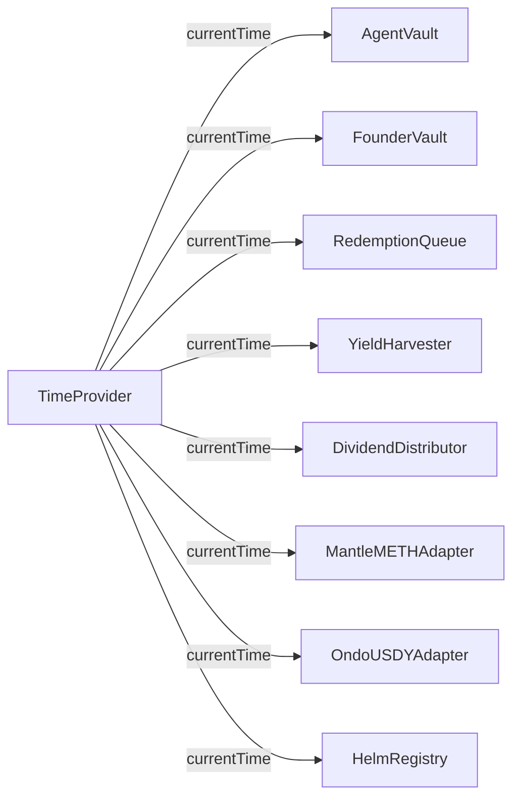

**Internal formula**:

```solidity
function currentTime() external view returns (uint256) {
    return block.timestamp + timeOffset;
}
```

**ChainId guard** (frozen at construction):

```solidity
constructor() {
    admin = msg.sender;
    devEnabled = (block.chainid == 5003 || block.chainid == 31337);
}

modifier onlyDevEnabled() {
    if (!devEnabled) revert NotDevEnabled();
    _;
}

function advance(uint256 secondsToAdd) external onlyAdmin onlyDevEnabled {
    timeOffset += secondsToAdd;
}
```

**Why immutable**: once deployed to mainnet, `devEnabled` is permanently `false`. Even if the admin were compromised, they cannot advance time. The offset stays 0 forever.

> **For demos**: `admin → timeProvider.advance(30 days)` skips incubation, lockups, and senior windows in one call.

### 9.2 MockUSDC mint backstop (testnet vs mainnet)

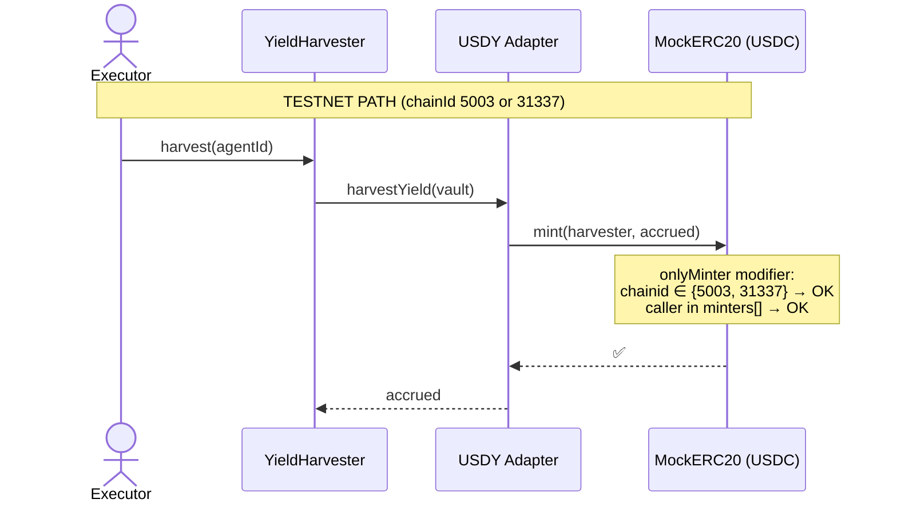

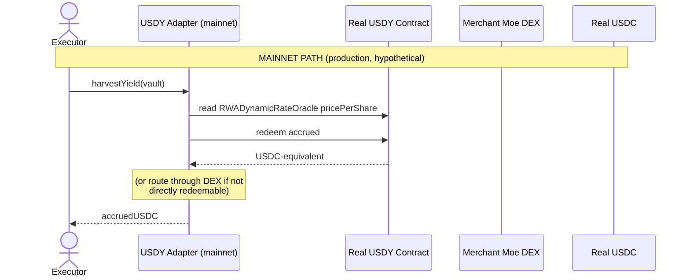

```solidity
// MockERC20.sol — the chainId guard
modifier onlyMinter() {
    if (msg.sender != minterAdmin) {
        bool testnet = block.chainid == 5003 || block.chainid == 31337;
        if (!testnet || !minters[msg.sender]) revert NotMinter();
    }
    _;
}
```

> **Safety property**: even if someone deploys this MockERC20 to mainnet and points the adapters at it, the `mint` function reverts for any non-admin caller because `testnet == false`. There's no path to print real value.

### 9.3 Pyth update flow

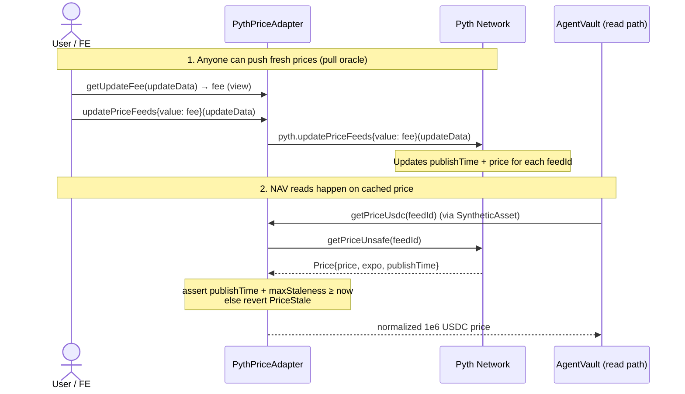

**Staleness windows**:

| Feed type | Max staleness | Rationale |
|---|---|---|
| Crypto (ETH/USD) | 60 seconds | Pyth updates these every ~400ms in practice |
| Equity (NVDA, SPY, …) | 96 hours | Equity feeds publish during market hours only; weekends + holidays inflate the staleness window |

> **Who pays the update fee?** Whoever calls `updatePriceFeeds`. In production, the BE cron pushes prices before rebalance or NAV-critical operations. In demos, FE can push prices alongside user actions.

### 9.4 Clones (EIP-1167) pattern

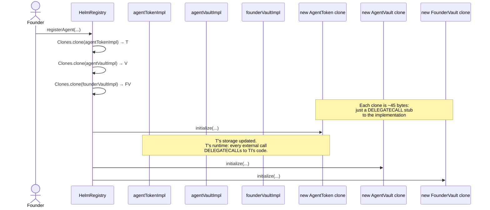

**Gas comparison** (approximate, based on `forge test` runs):

| Approach | Per-agent deploy cost |
|---|---|
| Re-deploy each implementation (no clones) | ~5,500,000 gas |
| EIP-1167 clones (current) | ~150,000 gas |

Savings: **~97%**. Also keeps `HelmRegistry` well under the EIP-170 24,576-byte runtime-bytecode cap (it would blow past with all 3 implementations inlined).

### 9.5 Subordination math

`FounderVault.isSubordinationActive()`:

```solidity
function isSubordinationActive() external view returns (bool) {
    if (totalDeposited == 0) return false;
    return (totalWithdrawn * BPS_DENOM) / totalDeposited >= subordinationThresholdBps;
}
```

**Threshold check on `withdraw`**:

```solidity
uint256 newTotalWithdrawn = totalWithdrawn + amount;
if (totalDeposited > 0) {
    uint256 withdrawnBps = (newTotalWithdrawn * 10000) / totalDeposited;
    if (withdrawnBps > subordinationThresholdBps) revert SubordinationBreached();
}
```

**Worked example** with `subordinationThresholdBps = 4000` (40%) and `totalDeposited = 200,000` AGT:

| Step | `totalWithdrawn` | `withdrawnBps` | Allowed? |
|---|---|---|---|
| Withdraw 50k | 50,000 | 2500 | ✅ |
| Withdraw 30k more | 80,000 | 4000 | ✅ (= threshold, not > ) |
| Withdraw 1 AGT more | 80,001 | 4000 (integer div) | depends on rounding; effectively borderline. In test, withdraw of 1 *additional* unit pushes to 4000.05 → reverts |
| Wait for `claimCarry` (USDC, not shares) | — | — | always allowed |

**Queue-driven subordination** (different from withdraw):

```solidity
// In RedemptionQueue._checkSubordinationAndTrigger
uint256 supply       = AGT.totalSupply();        // shrinks as users redeem
uint256 founderHeld  = FV.totalSharesHeld();     // stays mostly constant
uint256 founderBps   = founderHeld * 10000 / supply;
uint256 threshold    = FV.subordinationThresholdBps();
if (founderBps >= threshold) {
    vault.triggerWindDown("subordination_breach_via_redemption");
}
```

> **Two different checks**:
> 1. Founder `withdraw` checks **cumulative-withdrawn / total-deposited**. Protects against repeated dumps.
> 2. Queue claim checks **founder-held / current-supply**. Protects against outside-holder exodus that would leave founder dominant.

---

## 10. Cheat sheet

| I want to … | Call this |
|---|---|
| **Agent registration** | |
| Register a new agent | `helmRegistry.registerAgent(mandateHash, mandateURI, seedUSDC, assets, weightConstraints)` |
| Advance from Incubation | `helmRegistry.advanceToPublic(agentId)` (after 30 days) |
| **Holder operations** | |
| Buy agent shares | `vault.deposit(usdcAmount, receiver)` |
| Buy exact share count | `vault.mint(shareCount, receiver)` |
| Request redemption | `redemptionQueue.requestRedeem(agentId, shares, LockupTier.ThirtyDay)` |
| Cancel pending redemption | `redemptionQueue.cancel(requestId)` (must be ≥1 day before unlock) |
| Claim matured redemption | `redemptionQueue.claim(requestId)` |
| Claim dividend | `distributor.claim(agentId, [1, 2, 3])` (pass epoch IDs) |
| **Founder operations** | |
| Deposit more founder shares | `agentToken.approve(founderVault, n)` + `founderVault.depositFounderShares(n)` |
| Withdraw shares (after lockup) | `founderVault.withdraw(amount)` |
| Claim accumulated carry | `founderVault.claimCarry()` |
| Manually trigger wind-down | `founderVault.triggerWindDown(reason)` |
| **BE executor operations** | |
| Run rebalance | `vault.executeRebalance(targetPositions, strategyProof)` |
| Harvest yield | `yieldHarvester.harvest(agentId)` |
| Register a yield source | `yieldHarvester.registerSource(agentId, adapter, config)` |
| Stage + distribute dividend | `distributor.stageYield(agentId, amount)` then `distributor.distribute(agentId)` |
| **Admin operations** | |
| Slash an agent (reputation) | `agentNFT.slash(agentId, amountBps, reason)` |
| Force agent to Slashed phase | `helmRegistry.slash(agentId, reason)` |
| Set allowed redemption tiers | `redemptionQueue.setAllowedTiers(agentId, [true, true, false, false])` |
| Withdraw collected fees | `treasury.withdraw(to, amount)` |
| Update fee rates | `treasury.setFeeRates(mintBps, redeemBps, rebalanceBps)` |
| **Wind-down operations** | |
| Liquidate next position | `vault.progressWindDown()` (call until returns 0) |
| Finalize settlement | `vault.settle()` (after senior window) |
| **Demo / testnet** | |
| Fast-forward 30 days | `timeProvider.advance(30 days)` |
| Reset clock | `timeProvider.reset()` |
| Mint testnet USDC | `mockUSDC.mint(to, amount)` (admin only) |
| **Read-only views (FE)** | |
| Get NAV per share | `vault.totalNAV() / vault.totalSupply()` |
| Get total NAV (USDC, 6-dec) | `vault.totalNAV()` |
| Get cash USDC | `vault.cashUSDC()` |
| Get current phase | `vault.phase()` |
| Get reputation | `agentNFT.reputationOf(agentId)` |
| Is agent healthy? | `agentNFT.isHealthy(agentId)` |
| Get pending dividend | `distributor.pendingClaimOf(agentId, holder)` |
| Get pending redemption requests | `redemptionQueue.pendingRequestsOf(holder)` |
| Get fee rates | `treasury.feeRates()` (returns (mint, redeem, rebalance)) |
| Get agent deployment addresses | `helmRegistry.deploymentOf(agentId)` |
| Get current time | `timeProvider.currentTime()` |
| Get founder lockup end | `founderVault.lockupEndsAt()` |
| Get cumulative withdrawn % | `founderVault.cumulativeWithdrawnBps()` |

---

## 11. Common errors

### 11.1 Authentication errors

| Error | Emitter | Means | Fix |
|---|---|---|---|
| `OnlyAdmin` | PlatformTreasury, HelmRegistry | Caller is not admin | Use admin EOA |
| `NotAdmin` | TimeProvider, AgentNFT | Caller is not admin | Use admin EOA |
| `OnlyVault` | AgentToken | Only the linked AgentVault may call | Route via vault |
| `OnlyExecutor` | AgentVault, YieldHarvester | Caller is not the registered executor | Use BE executor key |
| `OnlyHarvester` | AgentVault | Only YieldHarvester may call `depositYield` | Route via harvester |
| `OnlyRedemptionQueue` | AgentVault | Only the queue may call `fulfillRedemption` | Route via queue |
| `OnlyRegistry` | AgentVault | Only HelmRegistry may call `enterPublicLaunch` | Route via registry.advanceToPublic |
| `OnlyRegisteredVault` | SyntheticAsset | Only registered agent vaults may mint/burn | Admin must `registerVault(yourVault)` |
| `OnlyDistributor` | FounderVault | Only DividendDistributor may call `receiveCarry` | Route via distributor.distribute |
| `OnlyFounder` | FounderVault | Only the founder EOA may call | Use founder key |
| `OnlyFounderDuringIncubation` | AgentVault | During incubation only founder can deposit | Wait for PublicLaunch |
| `NotRegistry` / `NotRegistryOrAdmin` | AgentNFT | NFT mint/slash auth failed | Use registry or admin |
| `NotHarvester` | DividendDistributor | Only harvester may stage/distribute | Route via harvester |
| `NotFounder` | FounderVault | Identity mismatch | Use founder key |
| `NotRequestOwner` | RedemptionQueue | Trying to claim/cancel someone else's request | Use the original requester |
| `NotVault` | HelmRegistry | `markWindDown` / `notifyMandateBreach` / `markSettled` not called from registered vault | Route via vault |
| `NotAuthorizedToWindDown` | AgentVault | `triggerWindDown` direct call not from founderVault / registry / queue | Use one of those |
| `NotDevEnabled` | TimeProvider | Not on chainId 5003 or 31337 | Only on testnet/anvil |

### 11.2 State / lifecycle errors

| Error | Means | Fix |
|---|---|---|
| `AlreadyAdvanced` | `advanceToPublic` called twice | No-op; agent already past incubation |
| `IncubationNotComplete(endsAt)` | 30 days haven't elapsed | Wait or `timeProvider.advance` |
| `IncubationStillActive(endsAt)` | Same as above (interface error) | Same |
| `WrongPhase` | Action not allowed in current phase | Check `vault.phase()` |
| `MintsDisabled` | Vault is in wind-down | Cannot deposit during wind-down |
| `WindDownActive` | Action blocked because already winding down | Wait for settle |
| `WindDownNotActive` | `progressWindDown` / `settle` called before trigger | Trigger first |
| `SeniorWindowOpen(endsAt)` | Settle / junior redeem blocked during senior window | Wait or advance time |
| `PositionsNotLiquidated(remaining)` | `settle` called with non-zero positions | Call `progressWindDown` until 0 |
| `AlreadySettled` | Settle called twice | Terminal state |
| `LockupActive(unlockAt)` | Founder withdrawal during lockup | Wait or advance time |
| `StillLocked(unlockAt)` | Queue claim before maturity | Wait or advance time |
| `CancelWindowClosed` | Trying to cancel within 1 day of unlock | Just wait + claim instead |
| `MandateLockedAfterIncubation` | Trying to change mandate post-incubation | Mandate is immutable after launch |
| `TransfersDisabled` / `TransfersFrozen` | ERC-4626 facade transfer call | Use AgentToken directly |
| `ERC4626RedeemDisabled` | Standard ERC-4626 withdraw/redeem | Use RedemptionQueue.requestRedeem |

### 11.3 Input / validation errors

| Error | Means | Fix |
|---|---|---|
| `MandateInvalid` | Zero hash or empty URI | Provide valid mandateHash + mandateURI |
| `MandateAlreadyUsed(hash)` | Duplicate mandate hash | Use unique hash |
| `InsufficientSeed` | Seed < 1000 USDC | Provide ≥ 1000 USDC seed |
| `InvalidCarryBps` | `carryBps != 1000` | Use exactly 1000 (10%) |
| `InvalidFounderShareBps` | Outside [500, 3000] | Use 5-30% (500-3000 bps) |
| `InvalidLockupDays` | `lockupDays < 90` | Use ≥ 90 days |
| `InsufficientShares` | Burn / redeem more shares than supply | Check supply |
| `InsufficientCash` | Not enough USDC for fee / payout | Top up vault or wait for harvest |
| `ZeroAmount` | Calling with `amount == 0` | Pass a positive amount |
| `ZeroAddress` | Address parameter is `address(0)` | Provide a valid address |
| `AssetNotWhitelisted(asset)` | Rebalancing into a non-whitelisted asset | Use only `assets` declared on registration |
| `MandateBreach(asset, actual, min, max)` | Post-rebalance weight outside bounds | Adjust targets to satisfy `[minBps, maxBps]` |
| `TierNotAllowedByMandate(tier)` | Lockup tier not enabled for this agent | Admin must `setAllowedTiers` |
| `EmptyYieldPool` | `distribute` called with no staged yield | Stage first |
| `EpochNotFinalized(agentId, epoch)` | Claiming an unsealed epoch | Wait for distribute |
| `AlreadyClaimed(agentId, epoch, holder)` | Double-claim attempt | No-op |
| `AlreadyCancelled` / `AlreadyClaimed` (queue) | Request state already terminal | Check `requestOf(id)` |
| `InvalidSlashAmount` | `amountBps == 0` or `> 10000` | Pass 1-10000 |
| `InvalidPhaseTransition(from, to)` | Bad transition request | Follow the state machine |
| `SubordinationBreached` | Withdraw would exceed threshold | Reduce amount or wait for vesting |

### 11.4 Oracle / adapter errors

| Error | Means | Fix |
|---|---|---|
| `PriceStale(feedId, publishTime, maxAge)` | Pyth feed is older than its window | Call `pythAdapter.updatePriceFeeds(updateData)` first |
| `PriceNegative(feedId, raw)` | Pyth returned a negative price (sanity check failure) | Pause; investigate feed |
| `UnknownFeed(feedId)` | Feed not registered in PythPriceAdapter | Constructor-time only; redeploy |
| `InsufficientUpdateFee(sent, required)` | Not enough ETH attached to `updatePriceFeeds` | Call `getUpdateFee` first |
| `SlippageTooHigh(minOut, actualOut)` | Adapter swap exceeded slippage | Pass `minOut = 0` or wider tolerance |
| `UnknownSource(source)` | Removing an unregistered yield source | Verify with `sourcesOf` |
| `NonTransferable` | Synthetic asset transfer attempt | These tokens are non-transferable by design |

---

## 12. Inheritance & dependency

### 12.1 Inheritance

```mermaid
classDiagram
    class IAgentVault {
        <<interface>>
        +initialize(InitParams)
        +deposit(assets, receiver)
        +executeRebalance(targets, proof)
        +fulfillRedemption(holder, shares)
        +triggerWindDown(reason)
        +settle()
    }
    class IERC4626 {
        <<interface>>
        +asset()
        +totalAssets()
    }
    class Initializable
    class ReentrancyGuard
    class AgentVault {
        +phase
        +totalNAV()
        +cashUSDC()
        +yieldPool
    }
    IAgentVault --|> IERC4626
    AgentVault ..|> IAgentVault
    AgentVault --|> Initializable
    AgentVault --|> ReentrancyGuard

    class ERC20Upgradeable
    class IAgentToken {
        <<interface>>
    }
    class AgentToken
    AgentToken --|> ERC20Upgradeable
    AgentToken ..|> IAgentToken

    class IFounderVault {
        <<interface>>
    }
    class FounderVault
    FounderVault ..|> IFounderVault
    FounderVault --|> Initializable
    FounderVault --|> ReentrancyGuard

    class ERC721
    class AgentNFT {
        +reputationScore
        +slash()
    }
    AgentNFT --|> ERC721

    class IHelmRegistry {
        <<interface>>
    }
    class HelmRegistry
    HelmRegistry ..|> IHelmRegistry

    class ISyntheticAsset {
        <<interface>>
    }
    class SyntheticAsset
    SyntheticAsset ..|> ISyntheticAsset
    SyntheticAsset --|> ReentrancyGuard

    class IPyth {
        <<external>>
    }
    class IPythPriceAdapter {
        <<interface>>
    }
    class PythPriceAdapter
    PythPriceAdapter ..|> IPythPriceAdapter

    class IMantleMETHAdapter {
        <<interface>>
    }
    class MantleMETHAdapter
    MantleMETHAdapter ..|> IMantleMETHAdapter

    class IOndoUSDYAdapter {
        <<interface>>
    }
    class OndoUSDYAdapter
    OndoUSDYAdapter ..|> IOndoUSDYAdapter

    class IRedemptionQueue {
        <<interface>>
    }
    class RedemptionQueue
    RedemptionQueue ..|> IRedemptionQueue
    RedemptionQueue --|> ReentrancyGuard

    class IYieldHarvester {
        <<interface>>
    }
    class YieldHarvester
    YieldHarvester ..|> IYieldHarvester
    YieldHarvester --|> ReentrancyGuard

    class IDividendDistributor {
        <<interface>>
    }
    class DividendDistributor
    DividendDistributor ..|> IDividendDistributor
    DividendDistributor --|> ReentrancyGuard

    class IPlatformTreasury {
        <<interface>>
    }
    class PlatformTreasury
    PlatformTreasury ..|> IPlatformTreasury

    class ITimeProvider {
        <<interface>>
    }
    class TimeProvider
    TimeProvider ..|> ITimeProvider
```

### 12.2 Interface dependency graph

Who depends on which interface (to read or call):

```mermaid
flowchart TB
    R[HelmRegistry] --> IAV[IAgentVault]
    R --> IAT[IAgentToken]
    R --> IFV[IFounderVault]
    R --> ITP[ITimeProvider]
    R --> NFT[AgentNFT struct usage]

    V[AgentVault] --> IAT
    V --> IFV
    V --> IPT[IPlatformTreasury]
    V --> ISY[ISyntheticAsset]
    V --> IME[IMantleMETHAdapter]
    V --> IUY[IOndoUSDYAdapter]
    V --> ITP

    FV[FounderVault] --> IAT
    FV --> IAV
    FV --> ITP

    Q[RedemptionQueue] --> IAV
    Q --> IAT
    Q --> IFV
    Q --> IHR[IHelmRegistry]
    Q --> ITP

    H[YieldHarvester] --> IAV
    H --> IHR
    H --> IME
    H --> IUY
    H --> ITP

    D[DividendDistributor] --> IHR
    D --> IFV
    D --> ITP

    SY[SyntheticAsset] --> PA[PythPriceAdapter direct]

    ME[MantleMETHAdapter] --> ITP
    ME --> IPyth[IPyth - external]
    UY[OndoUSDYAdapter] --> ITP
    PA --> IPyth

    classDef iface fill:#fef3c7,stroke:#a16207,color:#78350f
    class IAV,IAT,IFV,IPT,ISY,IME,IUY,ITP,IHR,IPyth iface
```

### 12.3 External library dependencies

| Library | Used by | Purpose |
|---|---|---|
| `@openzeppelin/contracts/token/ERC20/IERC20.sol` | every USDC flow | Standard ERC-20 |
| `@openzeppelin/contracts/token/ERC20/utils/SafeERC20.sol` | every transfer | Reentrancy-safe transfers + non-standard token handling |
| `@openzeppelin/contracts/proxy/Clones.sol` | HelmRegistry | EIP-1167 minimal proxies |
| `@openzeppelin/contracts/proxy/utils/Initializable.sol` | AgentVault, FounderVault | Clone-safe constructor replacement |
| `@openzeppelin/contracts/token/ERC721/ERC721.sol` | AgentNFT | NFT base |
| `@openzeppelin/contracts/utils/ReentrancyGuard.sol` | AgentVault, FounderVault, SyntheticAsset, RedemptionQueue, YieldHarvester, DividendDistributor | Reentrancy protection |
| `@openzeppelin/contracts/interfaces/IERC4626.sol` | IAgentVault | ERC-4626 surface |
| `@openzeppelin-upgradeable/token/ERC20/ERC20Upgradeable.sol` | AgentToken | Upgradeable ERC-20 (for clones) |
| `@pyth-sdk-solidity/IPyth.sol` | PythPriceAdapter, MantleMETHAdapter | Pyth pull oracle |
| `@pyth-sdk-solidity/PythStructs.sol` | PythPriceAdapter, MantleMETHAdapter | Pyth price struct |

---

## Appendix — Reading order for new contributors

If you're new to the codebase, read in this order:

1. **[IDEA.md](../IDEA.md)** — business spec, decisions, REIT model rationale.
2. **[CLAUDE.md](../CLAUDE.md)** — coding conventions, hard constraints, naming.
3. **[src/interfaces/](../src/interfaces/)** — read all 14 interfaces first to grasp the public surface without implementation noise.
4. **[src/system/TimeProvider.sol](../src/system/TimeProvider.sol)** — smallest contract, single concept.
5. **[src/system/AgentNFT.sol](../src/system/AgentNFT.sol)** — singleton ERC-721, reputation.
6. **[src/core/AgentToken.sol](../src/core/AgentToken.sol)** — minimal clone-deployable ERC-20.
7. **[src/system/PlatformTreasury.sol](../src/system/PlatformTreasury.sol)** — fee bookkeeping.
8. **[src/adapters/PythPriceAdapter.sol](../src/adapters/PythPriceAdapter.sol)** — oracle wrapper with staleness.
9. **[src/adapters/SyntheticAsset.sol](../src/adapters/SyntheticAsset.sol)** — Pyth-priced equity token.
10. **[src/adapters/OndoUSDYAdapter.sol](../src/adapters/OndoUSDYAdapter.sol)** — simplest accruing-yield adapter.
11. **[src/adapters/MantleMETHAdapter.sol](../src/adapters/MantleMETHAdapter.sol)** — adds Pyth ETH/USD layer.
12. **[src/core/FounderVault.sol](../src/core/FounderVault.sol)** — clone, lockup + subordination + carry.
13. **[src/core/AgentVault.sol](../src/core/AgentVault.sol)** — ⭐ the central contract, read after everything else.
14. **[src/system/RedemptionQueue.sol](../src/system/RedemptionQueue.sol)** — pulls AgentVault, FounderVault.
15. **[src/yield/YieldHarvester.sol](../src/yield/YieldHarvester.sol)** — adapter loop.
16. **[src/yield/DividendDistributor.sol](../src/yield/DividendDistributor.sol)** — epoch-based pro-rata.
17. **[src/system/HelmRegistry.sol](../src/system/HelmRegistry.sol)** — finally, the factory orchestrator.
18. **[test/IntegrationTest.t.sol](../test/IntegrationTest.t.sol)** — end-to-end flows that exercise everything above.

---

*End of architecture guide. For deployment status see [CONTRACT_STATUS.md](CONTRACT_STATUS.md); for business decisions see [IDEA.md](../IDEA.md).*
